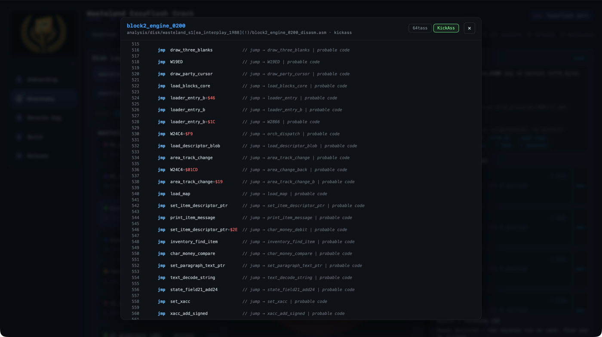
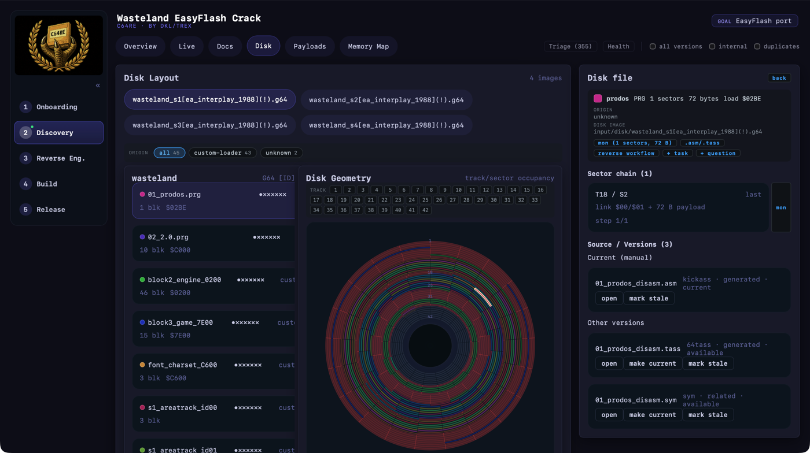
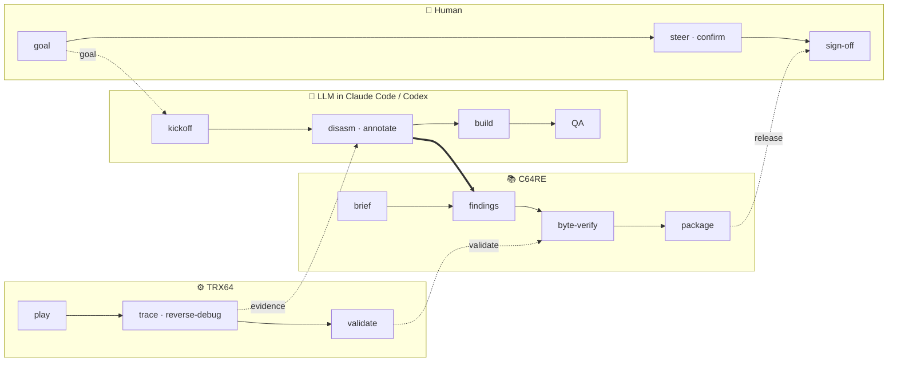
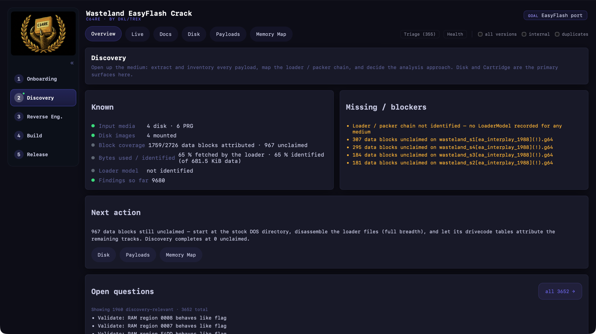

# C64RE

A reverse-engineering workbench for Commodore 64 software via MCP.
Turns disks, cartridges and PRGs into explained, named source,
and keeps learning as project knowledge.

**User and LLM share the project.** The LLM brings structure and mines meaning, the human
steers and confirms, a C64 runtime is used to validate findings.

**Sibling project:** [TRX64](https://github.com/Jondalar/TRX64) is the runtime — a
cycle-accurate C64 + 1541 + cartridge daemon. Capability lives there, meaning and memory
live here. C64RE carries no emulator; it is a client.

---

## The disassembly pipeline

Bytes → structure → meaning, and the third step is the one that matters.

1. **Extraction** — PRG / CRT / D64 / G64: banks, sectors, directory, xrefs, candidate
   segments, including disk and cartridge forensics.
2. **Heuristic disassembly** — the full 6502 ISA including undocumented opcodes. Nine
   analyzers in parallel: code discovery, text, sprites, charsets, screen RAM, bitmaps,
   pointer tables, SID, probable code. Overlaps get resolved.
3. **Semantic annotation** — the LLM reads the whole listing and proposes segment
   reclassifications, labels and routine explanations. Where
   `segment $7C21-$7F4F contains code` becomes `loader-side dispatcher: switches KERNAL
   serial → custom fastloader`.
4. **Verification** — assemble with KickAssembler/64tass and rebuild the original byte
   for byte. `cmp -l` decides; annotations never touch bytes.



*Step 3: a game engine's jump table, named — and verified byte-identical.*



*Step 1: block attribution per track and sector, a file's sector chain, its sources.*
## The knowledge base

Findings, entities, relations, payloads, flows, open questions — written to the project
and linked to artifacts and addresses they came from. Runtime evidence is registered as
an artifact and attached to a finding.

- Every claim carries its evidence and the address range it covers.
- Artifacts are versioned with lineage.

## The agentic flow

Work moves through a five-phase lifecycle under explicit roles — **analyst** forms and
tests hypotheses, **cartographer** maps structure and flow, **implementer** writes and
verifies. Each step is recorded, so a later session resumes instead of restarting.



Onboarding · Discovery · Reverse Engineering · Build · Release, navigated freely from the
left rail. The kickoff dialogue runs in the coding harness; C64RE records the brief.



*What the phase knows: established, blocked, next action — derived, not typed in.*

Details: [workflow](docs/workflow.md) · [roles](docs/agent-doctrine.md) ·
[pipeline](docs/re-phases.md) · [tools](docs/tools/analysis.md).

---

## Setup

```bash
git clone https://github.com/Jondalar/C64ReverseEngineeringMCP.git
cd C64ReverseEngineeringMCP && npm install && npm run build
```

**Claude Code** — `.mcp.json` at your RE-project root:

```json
{
  "mcpServers": {
    "c64-re": {
      "command": "npx",
      "args": ["tsx", "/path/to/C64ReverseEngineeringMCP/src/cli.ts"],
      "env": { "C64RE_PROJECT_DIR": "/path/to/your/re-project" }
    }
  }
}
```

**Codex** — `[mcp_servers.c64re]` with `command = "zsh"` and the same `tsx src/cli.ts`
invocation. `C64RE_PROJECT_DIR` is the only required variable; the runtime daemon is
found as the sibling TRX64 build and started on first use.

## The workbench

```bash
npm run ui:serve     # API + built UI on http://127.0.0.1:4310
npm run ui:dev       # Vite live reload on http://127.0.0.1:4311
```

One bundle: project knowledge — artifacts, findings, memory maps, media, disassembly —
and the live runtime view are the same app. The daemon owns the clock, monitor, media and
traces; browser and MCP are both clients, so a reload never resets a session.

**In the project folder itself**, `project_init` leaves launchers so nobody has to
remember any of the above:

| | |
|---|---|
| macOS / Linux | `./ui.sh start` · `restart` · `stop` · `status` · `logs` · `build-ui` |
| Windows | double-click **ui-start.cmd** / **ui-stop.cmd** / **ui-restart.cmd**, or `powershell -ExecutionPolicy Bypass -File .\ui.ps1 <action>` |

Both sets are written into every project, because a project folder travels between
machines. `ui.ps1` takes the project from its own location, so the folder can be copied
or renamed; only the path to *this repo* is baked, and `C64RE_REPO` overrides it
(`setx C64RE_REPO "C:\path\to\C64ReverseEngineeringMCP"`). `start` waits for the port
and then opens the browser. For a project that predates the launchers:

```bash
npm run launchers -- --project /path/to/project
```

## What to expect

This is my (dkl / Jondalar) personal Reverse Engineering Toolbox packaged
along my own needs when reverse engineering C64 games. *You* might need
different features or things - and you are invited to contribute.

Use issues here on GitHub please. PRs only to contributors, please reach out if you
want to send code.

I will not answer feature requests without sample code / structured requirements and I
have no capabilities to give real support.

---

## License

**GPL-3.0-or-later** — see [LICENSE](LICENSE). C64RE contains no emulator. It does carry
work read *from* [VICE](https://vice-emu.sourceforge.io/) — the monitor's verb set and
expression syntax, and the cartridge type table, whose every row cites the source it was
read from. VICE is GPL-2.0-or-later; C64RE uses the "or later" permission. Thank you to
the VICE project.

Further notices: [THIRD_PARTY_NOTICES.md](THIRD_PARTY_NOTICES.md).
**ROMs and third-party media** are not part of this license. Commodore ROM images,
commercial disks and cartridges must come from your own legally obtained copies.
