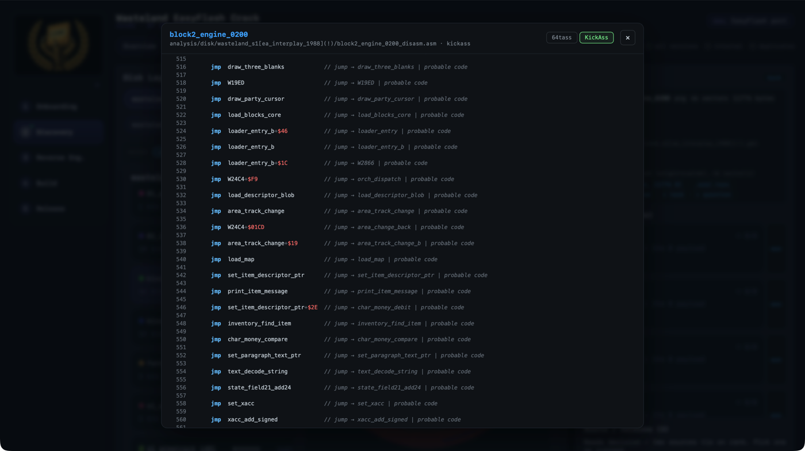
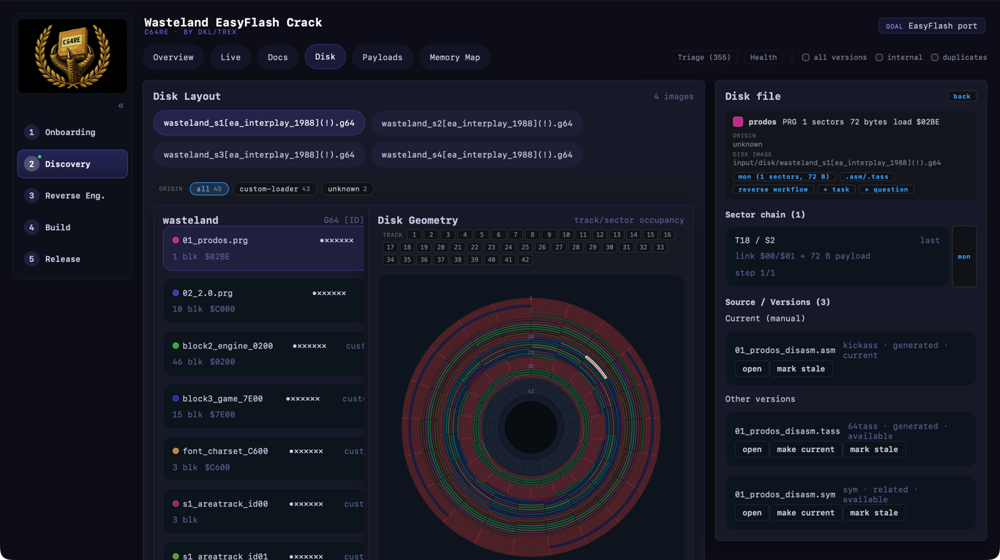
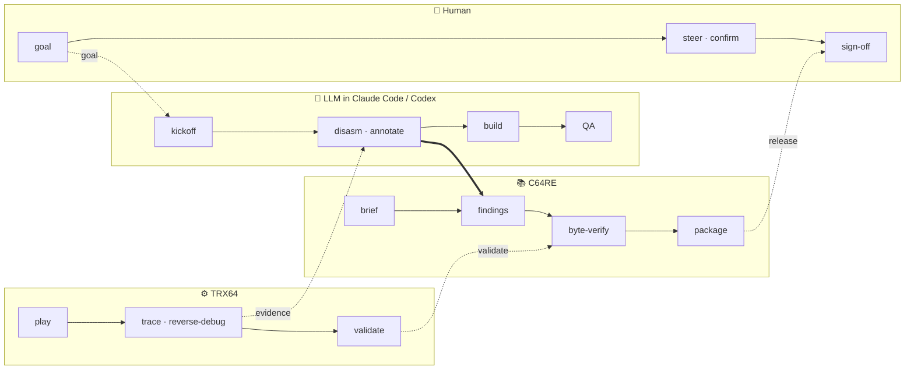
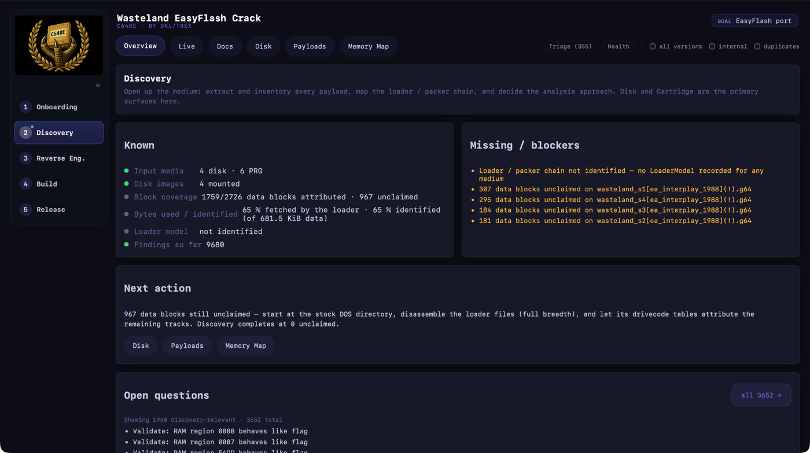

# C64RE

A reverse-engineering workbench for Commodore 64 software via MCP.
Turns disks, cartridges and PRGs into explained, named source,
and keeps learning as project knowledge.

**User and LLM share the project.** The LLM brings structure and mines meaning, the human
steers and confirms, a C64 runtime is used to validate findings.

**Sibling project:** [TRX64](https://github.com/Jondalar/TRX64) is the runtime — a
cycle-accurate C64 + 1541 + cartridge daemon. Capability lives there, meaning and memory
live here. C64RE carries no emulator; it is a client.

---

## The disassembly pipeline

Bytes → structure → meaning, and the third step is the one that matters.

1. **Extraction** — PRG / CRT / D64 / G64: banks, sectors, directory, xrefs, candidate
   segments, including disk and cartridge forensics.
2. **Heuristic disassembly** — the full 6502 ISA including undocumented opcodes. Nine
   analyzers in parallel: code discovery, text, sprites, charsets, screen RAM, bitmaps,
   pointer tables, SID, probable code. Overlaps get resolved.
3. **Semantic annotation** — the LLM reads the whole listing and proposes segment
   reclassifications, labels and routine explanations. Where
   `segment $7C21-$7F4F contains code` becomes `loader-side dispatcher: switches KERNAL
   serial → custom fastloader`.
4. **Verification** — assemble with KickAssembler/64tass and rebuild the original byte
   for byte. `cmp -l` decides; annotations never touch bytes.

A BASIC V2 program is not machine code and is not disassembled as if it were:
`basic_list` walks its line records, detokenises against the table the ROM itself
carries, names the PETSCII control codes, and reports which `SYS` hands control to
which address — so a BASIC loader and the machine code it starts are one story.
`basic_tokenize` is the inverse, and the round trip is byte-identical.



*Step 3: a game engine's jump table, named — and verified byte-identical.*



*Step 1: block attribution per track and sector, a file's sector chain, its sources.*
## The knowledge base

Findings, entities, relations, payloads, flows, open questions — linked to the artifacts
and addresses they came from. Runtime evidence is registered as an artifact and attached
to a finding.

Since Spec 822.2 all of it lives in **one graph** per project
(`knowledge/graph.sqlite`), not in a folder of JSON files. Two layers: what the
analysers derived and what a human asserted, kept apart and never overwriting each
other. Routines carry a computed signature — which registers they take, return, clobber
and preserve, and what they do to the stack — because assembler declares no interface
and the answer has to be computed rather than guessed. The Graph tab draws the whole
project four ways: force, layers, rings from a focus, and along the address axis with a
lane per bank.

- Every claim carries its evidence and the address range it covers.
- Artifacts are versioned with lineage.

## The agentic flow

Work moves through a five-phase lifecycle under explicit roles — **analyst** forms and
tests hypotheses, **cartographer** maps structure and flow, **implementer** writes and
verifies. Each step is recorded, so a later session resumes instead of restarting.


```mermaid
flowchart LR
    subgraph HU["🧑 Human"]
        H1[goal] --> H2[steer · confirm] --> H3[sign-off]
    end
    subgraph LL["🤖 LLM in Claude Code / Codex"]
        L1[kickoff] --> L2[disasm · annotate] --> L3[build] --> L4[QA]
    end
    subgraph CR["📚 C64RE"]
        C1[brief] --> C2[findings] --> C3[byte-verify] --> C4[package]
    end
    subgraph TX["⚙️ TRX64"]
        T1[play] --> T2[trace · reverse-debug] --> T3[validate]
    end
    H1 -. goal .-> L1
    T2 -. evidence .-> L2
    L2 ==> C2
    T3 -. validate .-> C3
    C4 -. release .-> H3
```

Onboarding · Discovery · Reverse Engineering · Build · Release, navigated freely from the
left rail. The kickoff dialogue runs in the coding harness; C64RE records the brief.



*What the phase knows: established, blocked, next action — derived, not typed in.*

Details: [workflow](docs/workflow.md) · [roles](docs/agent-doctrine.md) ·
[pipeline](docs/re-phases.md) · [tools](docs/tools/analysis.md).

---

## Setup

```bash
npx -y @trex64/c64re          # the server
npx @trex64/c64re runtime install   # the machine it drives
```

A project lives in a git repository — `project_init` creates one for a new project and the
tools refuse to run without `git` on `PATH` — because the contract, findings and
annotations in it are hand-written and history is the only way back from a wrong write.
Commit the project after a step that changed `knowledge/`.

Then point your harness at it and give it a project directory:

```json
{
  "mcpServers": {
    "c64-re": {
      "command": "npx",
      "args": ["-y", "@trex64/c64re"],
      "env": { "C64RE_PROJECT_DIR": "/path/to/your/re-project" }
    }
  }
}
```

ROM images are yours to supply — they are Commodore's property and are in no package.

Full setup, including a source checkout, Codex, Windows, WSL2 and containers, plus what to
do when it does not work: **[INSTALL.md](INSTALL.md)**.

## Starting and stopping

C64RE starts what it needs by itself: the runtime when a runtime tool first needs it, the
C64 Ultimate bridge when you select a device, a private machine for a sandbox run. Every
process it starts is entered in a ledger under `~/.c64re/processes/`, with its start time
and command line, so nothing is hunted by hand.

```bash
c64re status     # what runs: kind, pid, port, project, who started it, uptime, idle deadline,
                 # the selected runtime and the hold
c64re down       # shut everything down: the workbench, the bridges, the sandboxes, the runtime
c64re up         # start the runtime again (`c64re ui` starts the workbench)
```

`down` ends the processes in the ledger in that order, each one only if it is still the
process that was recorded (a pid the system has since handed to something else is never
touched), removes the runtime selection, and checks that nothing of C64RE is left running
or listening. A process on a C64RE port that C64RE did not start is named in the report and
left alone, and the exit code is then non-zero. It also leaves a *hold*: until `c64re up`,
`c64re ui`, `runtime_session_start` or selecting a C64 Ultimate, nothing is started again
by itself — not by the MCP server, not by a tool call, not by the workbench's dev server.
`down --project <dir>` ends only that project's processes; `down --keep daemon` leaves one
kind running; neither writes a hold. The same function is the `runtime_down` tool, which is
for you to ask for, not for the assistant to decide.

On Windows the same commands apply: C64RE asks each process to end first, and uses
`taskkill /T /F` only after five seconds.

## The workbench

```bash
npx -y @trex64/c64re ui --project /path/to/your/re-project   # from the package
npm run workspace -- --project /path/to/your/re-project      # from a checkout
npm run ui:dev                                               # Vite live reload on :4311
```

It opens on `http://127.0.0.1:4310`. The bundle ships with the package, so the **first**
line needs no build. From a checkout it does: `ui/dist/` is not in git, so
`npm run ui:build` once, and `npm run workspace` compiles the server on every start.

One bundle: project knowledge — artifacts, findings, memory maps, media, disassembly —
and the live runtime view are the same app. The daemon owns the clock, monitor, media and
traces; browser and MCP are both clients, so a reload never resets a session.

**A C64 Ultimate instead of the emulator.** The top bar names the runtime the workbench
drives: "TRX64 (emulator)" unless you chose otherwise. Open it and the workbench scans the
network for Ultimates (a UDP broadcast to port 64; Rescan repeats it). Every device that
answers is listed with its reason:

- **ready**: it runs the TRX64 core and the `trxmon` app. Select it.
- **monitor not running**: it has the core, `trxmon` is not started. **Start monitor**
  starts it over the device's REST API (from `/Flash/apps/trxmon.u2a`).
- **greyed out**: a stock core, an app that answered something else, or a device that wants
  its REST password. The password is asked once, kept in memory for this session, and never
  written anywhere.

Switching asks first, as switching a project does: the machine changes, so what is on screen
becomes another machine's. The choice belongs to the machine, not to the page: the assistant
and the workbench follow a switch made by either, and the page says so when the assistant
made it. A device is served by a bridge (`c64re c64u-bridge`), a process of its own that
holds the device's connection and speaks the runtime's protocol: the page connects to it
directly and the assistant uses it at the same time, so both drive the one machine. The
device sends picture and sound over UDP to the machine running the bridge: ports 11000
(video) and 11001 (audio), or `C64RE_C64U_VIDEO_PORT` / `C64RE_C64U_AUDIO_PORT`;
`C64RE_C64U_RECEIVER_HOST` names this machine's address when the automatic choice is wrong
for the device's network. While the device's machine is paused (breakpoint, freeze, scrub)
it sends no video: the Live tab keeps the last frame and marks it PAUSED, with its age.

Two things to know. Media, PRGs and cartridges reach a device only if the exact same bytes
passed a run in the emulator with at least one `Then` check (`c64re scenario run`, or
`runtime_sandbox_run` with a `Then`); anything else is refused with the file name and what is
missing. And the app's RPC port (4312) has no password even when the device's REST has one:
anyone on the network can reach it, and the device row says so.

**In the project folder itself**, starters so nobody has to remember any of the above.
`project_init` does not write them; you ask for them, for the system you use: tell the
assistant "give me the UI starters" (the `project_launchers` tool), or run
`npm run launchers -- --platform linux|macos|windows` (default: this system).

| | Double-click | From a shell |
|---|---|---|
| Linux | **ui-start.desktop** / **ui-stop.desktop** / **ui-restart.desktop** (start and restart open the browser; stop is `c64re down`) | `./ui.sh start` · `restart` · `stop` · `status` · `logs` · `build-ui`; add `--open` to open the browser |
| macOS | **ui-start.command** / **ui-stop.command** / **ui-restart.command** | the same `./ui.sh` |
| Windows | **ui-start.cmd** / **ui-stop.cmd** / **ui-restart.cmd** | `powershell -ExecutionPolicy Bypass -File .\ui.ps1 <action>` |

Only that system's files are written; naming another platform writes that one's set, for
a folder you hand to someone else. Existing files are kept, so hand edits survive; refresh
rewrites them. The `.desktop` files hold the project's absolute path, so do not commit
them, and refresh them after moving the project. The scripts take the project from their
own location so the folder can be copied or renamed. What they invoke depends on where they were written: beside an **installed
package** they call `c64re ui` — nothing at all is baked, because under `npx` the package
sits in a cache directory that moves. Beside a **checkout** they run the workspace script
there, and that one path is baked with `C64RE_REPO` overriding it
(`setx C64RE_REPO "C:\path\to\C64ReverseEngineeringMCP"`). On Windows `start` waits
for the port and then opens the browser; on Linux and macOS `ui.sh` does so with `--open`,
which the double-click starters pass (a plain `./ui.sh start` opens no window). For a
project that already exists:

```bash
npm run launchers -- --project /path/to/project --platform linux
```

Windows, start to finish: [docs/windows-setup.md](docs/windows-setup.md).

## Working on a smaller plan

`contrib/claude/skills/model-router` is the doctrine for spending model capacity when
the session runs Sonnet: `/deep` answers one hard turn on Opus without changing
the session model, `/cheap` puts a mechanical turn on Haiku, and the `reasoner`
(Opus) / `bulk` (Haiku) subagents let Claude route a sub-question by itself. The
skill carries the install command and is honest about what it does *not* save.

## What to expect

This is my (dkl / Jondalar) personal Reverse Engineering Toolbox packaged
along my own needs when reverse engineering C64 games. *You* might need
different features or things - and you are invited to contribute.

Use issues here on GitHub please. PRs only to contributors, please reach out if you
want to send code.

I will not answer feature requests without sample code / structured requirements and I
have no capabilities to give real support.

---

## License

**GPL-3.0-or-later** — see [LICENSE](LICENSE). C64RE contains no emulator. It does carry
work read *from* [VICE](https://vice-emu.sourceforge.io/) — the monitor's verb set and
expression syntax, and the cartridge type table, whose every row cites the source it was
read from. VICE is GPL-2.0-or-later; C64RE uses the "or later" permission. Thank you to
the VICE project.

The Live tab's VIC view — a raster line cycle by cycle, and the grid of line × cycle over the
frozen picture — takes its layout from [vicspector](https://github.com/elysium64/vicspector) by
elysium64 (MIT), an interactive VIC-II guide for C64 coders. Thank you. vicspector builds on
Linus Åkesson's VIC-II timing chart and MISC notes and Christian Bauer's VIC-II article, and the
raster techniques the view names (FLI, FLD, linecrunch, DMA delay, open borders, sprite crunch)
are named after them. The data in the view is the emulation's own, not a model.

Further notices: [THIRD_PARTY_NOTICES.md](THIRD_PARTY_NOTICES.md).
**ROMs and third-party media** are not part of this license. Commodore ROM images,
commercial disks and cartridges must come from your own legally obtained copies.
