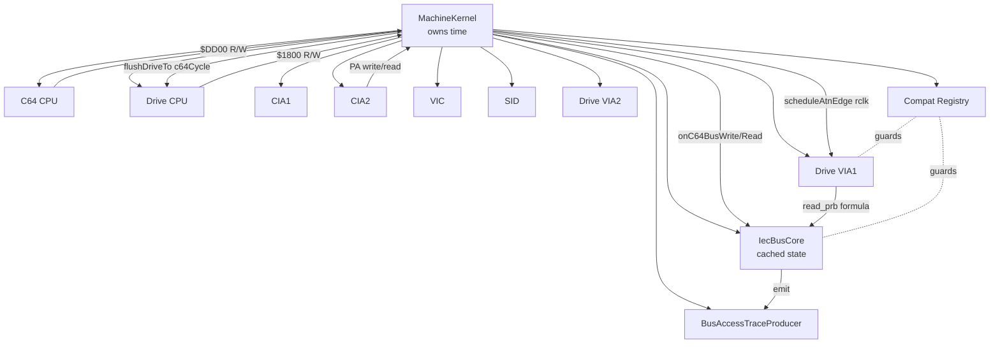
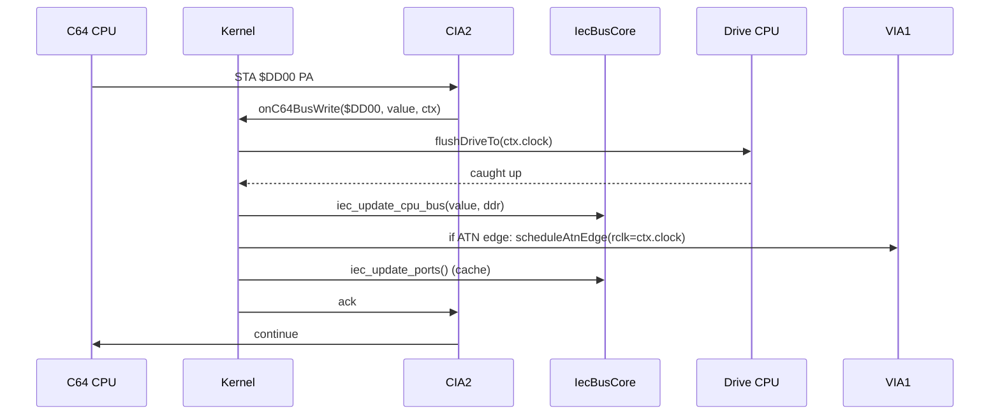

# Headless Machine Kernel Architecture

**Spec**: 139 (Sprint 112)
**Status**: design v1 — informed by Spec 138 probe result
**Companion**: `docs/vice-iec-arc42.md`, `docs/headless-core-synchronization-refactor.md`
**Probe data**: Spec 138 commit b571396 — all three variants diverge
from VICE byte stream; bit-encoding polarity mismatch at drive $1800
read level.

## Why this doc exists

Sprint 111 demonstrated that local fastloader patches do not converge.
The arc42 deep-dive (Spec 137) cataloged 9 architectural divergences
between VICE and our headless. The probe (Spec 138) confirmed all
three sync variants (push-flush only / drive-first tick / pure
push-model) diverge from VICE byte-for-byte. The remaining hypothesis
from arc42's ADR-2 — that VICE's *cached* `drv_port`/`cpu_port` plus
its bit-encoding XOR is load-bearing for fastloader correctness — is
now the leading explanation.

Before Spec 140 implements the cache + flush + bit-encoding fix,
Spec 139 establishes the architectural contract that every chip,
scheduler, and bus must follow. Without this contract the fix is
yet another local patch.

## Goals

1. Single, named owner of clock advancement.
2. Every observable bus event has a deterministic timestamp.
3. IEC observable behavior is intentionally VICE-compatible.
4. Compatibility hooks are mode-guarded, reportable, and never gate
   acceptance silently.
5. Bus-access trace (Spec 142) is part of the architecture, not a
   debug-only escape hatch.

## Non-goals

- Whole-machine clean-room rewrite. We refactor incrementally.
- Multi-instance / multi-machine.
- VIC frame-level timing (separate spec; VIC dispatches per char-row
  since Sprint 104).
- 1571 / 1581 / CMD-HD specifics.

---

## §1 Clock domains and time ownership

Two monotonic clock domains:

| Domain | Hz (PAL) | Hz (NTSC) | Owner |
|---|---|---|---|
| C64 | 985,248 | 1,022,727 | `MachineKernel.c64Cycle()` |
| Drive 1541 | 1,000,000 | 1,000,000 | `MachineKernel.driveCycle()` |

Ratio: PAL 1.014773 (drive ahead), NTSC 0.978 (drive behind). Encoded
as 16.16 fixed-point in the kernel (already done in
`cycle-lockstep-scheduler.ts`).

**Invariants**:

- Both clocks are owned solely by the kernel. No chip increments
  either independently.
- Drive may *lag* the c64 in the cycle-by-cycle stepping, but the
  push-flush invariant guarantees catch-up before any externally
  observable bus mutation or read on the c64 side.
- For probe variant C (and any future "pure push" mode), drive does
  not tick per cycle but the kernel still tracks `driveCycleCount`
  so trace events have a meaningful timestamp.

---

## §2 The `MachineKernel` interface

```ts
// src/runtime/headless/scheduler/machine-kernel.ts (new)

export type KernelMode = "hybrid" | "lockstep-only" | "push-flush-only";

export interface BusAccessContext {
  side: "c64" | "drive";
  clock: number;            // c64 cycle for c64 side, drive cycle for drive
  pc: number;
  opcode: number;
  phase: string;            // "fetch_op" | "read_ea" | etc; "" if legacy CPU
  rmw: boolean;
}

export interface MachineKernel {
  // Time
  c64Cycle(): number;
  driveCycle(): number;

  // Stepping
  runCycles(n: number): void;
  runInstructions(n: number, opts?: RunOpts): RunResult;
  step(): void;

  // Bus access entry points. Chips MUST route any access that
  // touches a peer chip's state through these. Local accesses (RAM,
  // ROM, VIA register that doesn't propagate) skip the kernel.
  onC64BusRead(addr: number, ctx: BusAccessContext): number;
  onC64BusWrite(addr: number, value: number, ctx: BusAccessContext): void;
  onDriveBusRead(addr: number, ctx: BusAccessContext): number;
  onDriveBusWrite(addr: number, value: number, ctx: BusAccessContext): void;

  // Diagnostics
  mode: KernelMode;                       // = "hybrid" by default (Q4)
  iecMode: "vice-cache" | "live";         // = "vice-cache" by default (Spec 140)
  invokedHooks: ReadonlyMap<string, number>;  // for Spec 144

  // Trace
  attachTraceProducer(p: BusAccessTraceProducer): void;
}

export interface RunOpts {
  breakpoints?: Set<number>;
  cycleBudget?: number;
}
export interface RunResult {
  instructionsExecuted: number;
  lastPc: number;
  aborted?: "breakpoint" | "cycle-budget";
}
```

**Ownership matrix**:

| Concern | Owner | Notes |
|---|---|---|
| Clock advancement | Kernel | per `executeCycle()` |
| Drive flush at IEC access | Kernel | invariant (no chip flushes peer) |
| ATN edge propagation | Kernel | calls `via1.scheduleAtnEdge(rclk)` |
| IEC cached port state | IecBusCore | mutated only by kernel-routed ops |
| Trace emission | BusAccessTraceProducer | injected by kernel |
| CPU IRQ pin sample | CPU | sampled at instruction boundary |
| IRQ stamp + delay | VIA / CIA | rclk recorded on IFR set, sampled by CPU |
| Compatibility hooks | CompatibilityRegistry | invoked through registry, never silent |



---

## §3 Bus access responsibility table

| Range | Side | Local or kernel? | Implementation |
|---|---|---|---|
| $0000-$0001 | c64 | local | CPU port (cpu6510 zp) |
| $0002-$BFFF | c64 | local | RAM (memory-bus.ts) |
| $C000-$CFFF | c64 | local | RAM |
| $D000-$D3FF | c64 | local | VIC registers |
| $D400-$D7FF | c64 | local | SID registers |
| $D800-$DBFF | c64 | local | Color RAM |
| $DC00-$DCFF | c64 | local | CIA1 |
| **$DD00-$DD0F** | c64 | **kernel** | CIA2; PA hits onC64BusRead/Write |
| $DE00-$DFFF | c64 | local | I/O 1/2 (cart) |
| $E000-$FFFF | c64 | local | KERNAL ROM |
| Drive $0000-$07FF | drive | local | Drive RAM |
| Drive $0800-$17FF | drive | local | open bus |
| **Drive $1800-$1BFF** | drive | **kernel** | VIA1; ORB hits onDriveBusRead/Write |
| Drive $1C00-$1FFF | drive | local | VIA2 (GCR); future may go through kernel |
| Drive $C000-$FFFF | drive | local | DOS ROM |

Only addresses with peer-state cross-coupling (= IEC bus) go through
the kernel. Everything else stays in the chip's own bus handler.

---

## §4 Push-flush invariant (Spec 140 implements)

**Invariant**: `kernel.flushDriveTo(c64Clock)` runs before any
externally observable IEC bus mutation or read on the c64 side.



In **hybrid mode** (Q4 default), the lockstep tick keeps drive
roughly current; the flush is a no-op when drive is already at
ctx.clock. In `push-flush-only` ablation mode (Spec 138 variant C),
the flush does the real catch-up.

---

## §5 IEC cache (Spec 140 implements)

The `IecBusCore` holds VICE-equivalent state:

```ts
class IecBusCore {
  cpu_bus: number = 0;     // c64-side pull pattern, derived from $DD00 PA write
  cpu_port: number = 0;    // composite seen by c64 (cpu_bus AND drv_bus[*])
  drv_data: Uint8Array;    // [16] raw drive PB output, inverted; slot 8 = drive
  drv_bus: Uint8Array;     // [16] precomposed contribution per unit
  drv_port: number = 0;    // composite seen by drive

  // VICE formulas, bit-exact:
  iec_update_cpu_bus(data, ddr): void { /* cpu_bus = ((data<<2)&0xC0) | ((data<<1)&0x10) */ }
  iec_update_ports(): void {
    // cpu_port = cpu_bus AND drv_bus[4..15]
    // drv_port = (cpu_port>>4 & 4) | (cpu_port>>7) | ((cpu_bus<<3) & 0x80)
  }
  drive_store_pb(byte, deviceId): void {
    // drv_data[deviceId+8] = ~byte
    // drv_bus[deviceId+8] = ((drv_data << 3) & 0x40)
    //                    | ((drv_data << 6) & ((~drv_data ^ cpu_bus) << 3) & 0x80)
    // iec_update_ports()
  }
  drive_read_pb_byte(prb, deviceId): number {
    // return (((prb & 0x1A) | drv_port) ^ 0x85) | (deviceId << 5)
  }
}
```

Cache invalidation: only `iec_update_cpu_bus` (c64 PA write) and
`drive_store_pb` (drive ORB write) mutate. Reads are pure cache loads.

The XOR `0x85` and AND-OR formulas come from VICE's
`src/iecbus/iecbus.c`, `src/c64/c64iec.c`, and
`src/drive/iec/via1d1541.c`. They encode the inverter chains and
ATN-AND-gate UE5 of the real schematic. **Spec 138 probe found
ours diverges from these exact formulas at the bit level** — the
fix is to use these formulas directly.

---

## §6 Clocked IRQ events (Spec 141 implements)

Every CA1/CB1/CA2/CB2 edge and T1/T2 underflow stamps an IRQ event
with `irq_clk = current_clock`. CPU samples IRQ pin at instruction
boundary AND only acts on stamps where `cpu_clock >= irq_clk + 2`
(Q6: `INTERRUPT_DELAY = 2` for both 6510 and 6502 in 1541).

ATN edge propagation:

```mermaid
sequenceDiagram
  participant CPU as C64 CPU
  participant K as Kernel
  participant IEC as IecBusCore
  participant VIA as VIA1
  participant DRV as Drive CPU

  CPU->>K: STA $DD00 with ATN bit changed
  K->>IEC: iec_update_cpu_bus
  IEC-->>K: ATN edge detected
  K->>VIA: scheduleAtnEdge(rclk=c64Clock_in_drive_units)
  VIA->>VIA: if PCR polarity matches: ifr |= CA1, irq_clk = rclk
  Note over DRV: continues current instruction
  DRV->>DRV: instruction boundary; samples irqAsserted(driveClock)
  DRV->>DRV: if irq_clk + 2 <= driveClock: vector to $FFFE
```

This eliminates the Sprint 66 `$7C` poke + `reevaluateCa1Level` hacks
that compensate for non-deterministic IRQ latency. Both fall under
Spec 144 mode-gate (`truedrive-rescue` only, removed from
`truedrive-pure`).

---

## §7 Migration map

Per-file impact, ordered by Sprint 112 sequence:

### Spec 140 — IEC core

| File | Change | Notes |
|---|---|---|
| `src/runtime/headless/scheduler/machine-kernel.ts` | NEW | Kernel impl wraps existing scheduler |
| `src/runtime/headless/iec/iec-bus.ts` | refactor | Add cache fields, retain live mode under flag |
| `src/runtime/headless/iec/iec-bus-core.ts` | NEW | VICE-formula recompute; called by kernel |
| `src/runtime/headless/peripherals/cia2.ts` | refactor | Route through kernel |
| `src/runtime/headless/drive/via6522.ts` | refactor | $1800 R/W routes through kernel |
| `src/runtime/headless/drive/via1-iec.ts` | refactor | drive_read_pb formula = VICE XOR 0x85 exactly |
| `src/runtime/headless/integrated-session.ts` | refactor | Replace direct chip wiring with kernel composition |
| `src/runtime/headless/scheduler/cycle-lockstep-scheduler.ts` | retain | becomes kernel internals |

### Spec 141 — Clocked IRQ

| File | Change | Notes |
|---|---|---|
| `src/runtime/headless/drive/via6522.ts` | refactor | IrqStamp, clocked irqAsserted(currentClock) |
| `src/runtime/headless/cia/cia6526.ts` | refactor | Same as above |
| `src/runtime/headless/cpu/cpu6510-cycled.ts` | refactor | sample IRQ pin via stamp+delay |
| `src/runtime/headless/scheduler/machine-kernel.ts` | refactor | scheduleAtnEdge routes ATN with rclk |
| `src/runtime/headless/iec/iec-bus.ts` | gate | $7C poke + reevaluateCa1Level → CompatibilityRegistry |

### Spec 144 — Mode hygiene

| File | Change | Notes |
|---|---|---|
| `src/runtime/headless/scheduler/compatibility.ts` | NEW | CompatibilityRegistry + HOOKS table |
| `src/runtime/headless/integrated-session.ts` | refactor | mode REQUIRED, throw if missing |
| `src/runtime/headless/iec/iec-bus.ts` | gate | $7C poke wrapped in registry.invoke |
| `src/runtime/headless/drive/via6522.ts` | gate | reevaluateCa1Level wrapped |
| `src/runtime/headless/traps/kernal-*.ts` | gate | KERNAL traps wrapped |
| `src/runtime/headless/drive/drive-cpu.ts` | gate | idle-skip wrapped |

---

## §8 Invariants future specs must preserve

1. **No peer-chip ticking**. Chip A may not call chip B's
   `executeCycle`/`step`/`tick`. Only the kernel ticks chips.
2. **Single clock per side**. Each chip records its own cycles
   privately; the kernel exposes `c64Cycle()` and `driveCycle()` as
   the only public clocks.
3. **All observable IEC mutations route through kernel**. CIA2 PA
   write, CIA2 PA read, drive VIA1 ORB write, drive VIA1 ORB read —
   all four are kernel entry points.
4. **All compatibility hooks invoke through registry**. Hooks have
   string IDs, allowed-mode lists, and per-run invocation counters.
   `pureRun` = invocation map is empty.
5. **Trace producer is opt-in**. When attached, it consumes events
   from the kernel; when not attached, zero overhead.
6. **Bit-exact VICE IEC formulas**. `iec_update_cpu_bus`,
   `iec_update_ports`, `read_prb` (XOR 0x85), drive PB store are
   bit-equivalent to VICE's formulas. Validated by Spec 143 diff.

---

## §9 Diagnostics + reporting

Session output exposes:

```json
{
  "kernelMode": "hybrid",
  "iecMode": "vice-cache",
  "compatibilityMode": "truedrive-pure",
  "pureRun": true,
  "invokedHooks": {},
  "c64Cycles": 38_000_000,
  "driveCycles": 38_550_000,
  "traceArtifact": "/tmp/.../bus_access.jsonl"
}
```

A test scenario in `truedrive-pure` mode that ends with `pureRun:
false` is an automatic failure.

---

## §10 Sprint 112 sequence (locked Q12)

```
Spec 142 (trace ring) ✓ DONE
  → Spec 143 (VICE diff) ✓ DONE
    → Spec 138 (probe A/B/C) ✓ DONE
      → Spec 139 (this doc) — DONE
        → Spec 140 (IEC core) — next
          → Spec 141 (clocked IRQ)
            → Spec 144 (mode hygiene)
```

---

## §11 Appendix — what we changed our minds on

- Originally arc42 ranked ADR-1 (push-flush) as standalone fix.
  Probe data showed push-flush alone, drive-first tick alone, and
  pure push-model alone all diverge from VICE byte stream. Spec 140
  must implement push-flush + cache + bit-encoding XOR together.
- Variant C (pure push-model) caused drive to never reach motm
  receive window in 50M c64 cycles. Confirms hybrid (Q4) is the
  only viable kernel mode for V2 production. Pure push-model stays
  as ablation toggle for diagnosis only.
- Bit-encoding polarity at drive $1800 read level was not flagged
  in arc42; probe surfaced it as the dominant divergence. Spec 140
  must adopt VICE's `((PRB & 0x1A) | drv_port) ^ 0x85` exactly.

---

## §12 References

- Spec 137 + `docs/vice-iec-arc42.md` — local divergence catalog
- `docs/headless-core-synchronization-refactor.md` — global
  architecture proposal (this doc operationalizes it)
- Spec 138 commit `b571396` — probe data + key finding
- Spec 142 + 143 — trace + diff tooling
- VICE 3.7.1 source: `src/iecbus/iecbus.c`, `src/c64/c64iec.c`,
  `src/c64/c64cia2.c`, `src/drive/drivecpu.c`,
  `src/drive/iec/via1d1541.c`, `src/core/viacore.c`
