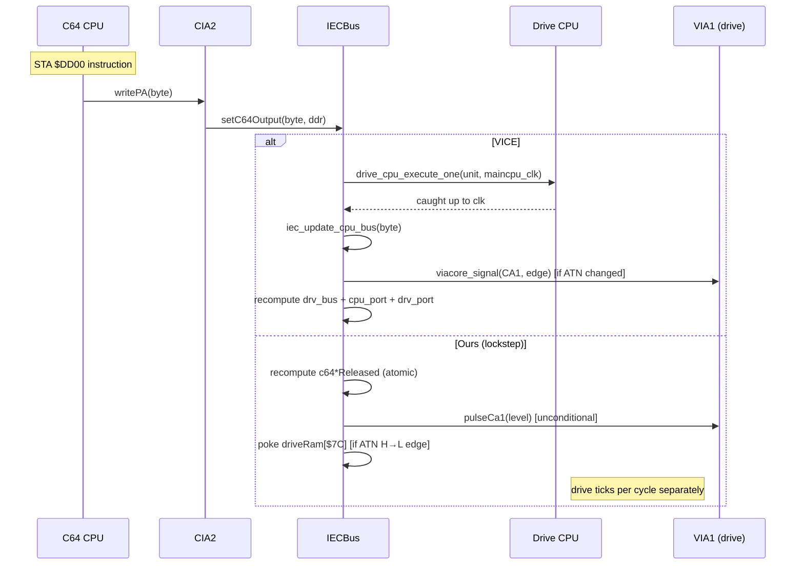

# Spec 137 — VICE IEC + drive-sync arc42 deep-dive

**Sprint**: 111 (1541 silicon)
**Phase**: investigation, pre-fix
**Status**: open

## Why

Sprint 111 hit ceiling: motm fastloader fails in headless because
drive's $1800 read returns wrong DATA bit during 24-bit serial
receive at $042F-$044C. 11 commits of speculative patching did not
localize root cause. Two prior fix attempts were reverted (Sprint
66 hack removal — neutral; `beforeC64Read` in lockstep — broke
MM regress).

Hypothesis: our drive↔C64 sync model is **not 1:1 with VICE**.
Without arc42-style structured comparison, every fix attempt is
guess-driven and likely wrong.

This spec defines the deliverable: a structured deep-dive doc
that maps VICE's IEC + drive-sync architecture to ours, with
sequence diagrams, divergence-table, and concrete fix-list ranked
by impact.

## Scope

**In scope:**
- VICE 3.7.1 source (`src/iecbus/`, `src/c64/c64iec.c`, `src/c64/c64cia2.c`,
  `src/drive/drivecpu.c`, `src/drive/iec/via1d1541.c`, `src/core/viacore.c`,
  `src/alarm.c`, `src/maincpu.c`, `src/cia/ciacore.c`)
- Our headless: `src/runtime/headless/iec/`, `src/runtime/headless/drive/`,
  `src/runtime/headless/scheduler/`, `src/runtime/headless/peripherals/cia*.ts`,
  `src/runtime/headless/cpu/cpu6510-cycled.ts`
- I/O surface only — VIC, SID, keyboard, joystick out of scope (those
  are settled or tracked elsewhere)

**Out of scope:**
- VIA's CB1/CB2/SR shifter (not used by motm fastloader)
- Parallel cable
- 1571/1581/CMD-HD specifics
- Burst mode (not used by motm)

## Deliverable: `docs/vice-iec-arc42.md`

Structured per arc42 §5/§6/§8/§9, **focused on I/O**:

### §5 Building Blocks (≈30% of doc)

For each VICE component, provide:
- **Purpose** (one paragraph)
- **State** (struct fields with types)
- **Interfaces** (functions called from outside, functions called outward)
- **Our equivalent** (file + class + method-level mapping)
- **Divergence flags** ⚠️ where ours differs

Components to cover:

1. **iecbus** (`src/iecbus/iecbus.c` + `src/c64/c64iec.c`)
   - State: `iecbus_t` (cpu_bus, cpu_port, drv_bus[], drv_data[], drv_port,
     iec_fast_1541)
   - Funcs: `iec_update_cpu_bus`, `iec_update_ports`, `iec_drive_write`,
     `iec_drive_read`, `iecbus_cpu_read_conf1`, `iecbus_cpu_write_conf1`
   - Our: `src/runtime/headless/iec/iec-bus.ts:IecBus`
   - Map: cpu_bus ↔ c64{Atn,Clk,Data}Released, drv_bus[8] ↔
     drive{Clk,Data}Released + driveAtnAckReleased, drv_port ↔
     `buildDrivePbInputBits`, cpu_port ↔ `buildC64InputBits`

2. **CIA2** (`src/c64/c64cia2.c`)
   - State: PA, DDRA, ICR, timer A/B, latches
   - PA write triggers `iec_update_cpu_bus` + `drive_cpu_execute_one`
   - Our: `src/runtime/headless/peripherals/cia2.ts` (or wherever
     `cia2-stub.ts` lives) → write side
   - Map ATN/CLK/DATA bits, inversion logic

3. **drivecpu** (`src/drive/drivecpu.c`)
   - `drivecpu_execute(drv, clk_value)`: run drive UP TO c64 clock
   - `drive_cpu_execute_all(clk)` and `drive_cpu_execute_one(unit, clk)`
     wrappers
   - sync_factor (16.16 fixed) + cycle_accum + stop_clk
   - Alarm context per drive
   - Our: `src/runtime/headless/drive/drive-cpu.ts:DriveCpu`,
     `executeToClock`, `setSyncRatio`, `setSyncBaseline`,
     scheduler `DriveCpuCycled` wrapper
   - **CRITICAL**: VICE drive runs BEFORE every c64 IEC access (push
     model). Our cycle-lockstep ticks drive AFTER c64's executeCycle in
     same-cycle. Document phase-of-tick implications.

4. **via1d1541** (`src/drive/iec/via1d1541.c` + `src/core/viacore.c`)
   - `read_prb`, `store_prb`: 1541-specific PB
   - `viacore_signal(via, sig, type)`: edge signal interface (CA1, CA2)
   - `set_int(via, num, value, rclk)`: IRQ propagation with cycle stamp
   - PCR edge polarity, IFR latch, IER mask
   - Our: `src/runtime/headless/drive/via6522.ts`, `via1-iec.ts`
   - Map: pulseCa1 vs viacore_signal, irqAsserted vs set_int

5. **Alarm system** (`src/alarm.c` + `src/alarm.h`)
   - Pending events queued by clock value
   - Drive CPU consumes alarms in its execute loop
   - VIA timers, CA1 edge events use this
   - Our: **NOTHING** — we tick everything per cycle. Document this
     architectural difference and whether it matters for IEC.

6. **maincpu_clk + drive clk_ptr**
   - Two distinct clock counters
   - drive clk_ptr advances inside drivecpu_execute
   - cpu_clk advances per c64 instruction
   - Our: `c64Cpu.cycles`, `drive.cpu.cycles`, `scheduler.cycleCount`,
     `scheduler.driveCycleCount`

### §6 Runtime View — Sequence Diagrams (≈40% of doc)

Mermaid sequence diagrams for these I/O scenarios. Each diagram has
TWO swimlanes: VICE actual flow on left, OUR flow on right. Same
inputs, marked divergence points with ⚠️.

#### 6.1 C64 stores $DD00 (writes ATN/CLK/DATA OUT)

VICE flow:
```
maincpu writes $DD00
  → cia2 store_pra(byte)
  → c64iec_active gate
  → iecbus_callback_write (= iecbus_cpu_write_conf1)
    → drive_cpu_execute_one(unit, maincpu_clk)
    → iec_update_cpu_bus(data)        // sets cpu_bus from inverted PA bits
    → if ATN edge: viacore_signal(via1d1541, CA1, RISE/FALL)
    → recompute iecbus.drv_bus[8]      // wired-AND with drive's drv_data
    → iec_update_ports()               // recompute cpu_port + drv_port
```

Ours:
```
c64.cpu writes $DD00 (CIA2 PA)
  → cia2.writePA(value)
  → IecBus.setC64Output(cia2Pa, ddrMask)
    → if (beforeC64Read) drive.executeToClock(c64Cpu.cycles)  // off in lockstep ⚠️
    → recompute c64{Atn,Clk,Data}Released
    → notifyAtnChanged()
      → driveVia1.pulseCa1(atnLine)   // fires CA1 IFR, sets IRQ pin
      → if ATN H→L edge: poke driveRam[$7C] = $80 ⚠️ (no VICE equiv)
    → recordEdge("c64", prev)
```

Divergence:
- ⚠️ VICE flushes drive in PUSH mode at every IEC write; we don't in lockstep
- ⚠️ $7C poke is non-VICE workaround
- ⚠️ VICE's viacore_signal queues edge with rclk; our pulseCa1 fires immediately

Sequence diagram (mermaid):


#### 6.2 C64 reads $DD00 (samples DATA-IN/CLK-IN)

VICE:
```
maincpu reads $DD00
  → cia2 read_pra
  → iecbus_callback_read (= iecbus_cpu_read_conf1)
    → drive_cpu_execute_all(maincpu_clk)   // PUSH drive forward
    → return iecbus.cpu_port               // staged from last update_ports
```

Ours:
```
c64.cpu reads $DD00
  → cia2.readPA()
  → IecBus.buildC64InputBits()
    → if (beforeC64Read) drive.executeToClock(c64Cpu.cycles)  // off in lockstep ⚠️
    → live compute clkLine + dataLine from c64* + drive* released flags
```

Divergence:
- ⚠️ VICE returns CACHED cpu_port (last computed during update_ports);
  drive flushed first to ensure cache fresh
- ⚠️ Ours computes live each call, but drive's contribution may be from
  previous c64 cycle's tick (lockstep order: CPU → peripherals → drive)

#### 6.3 Drive writes $1800 (PB output)

VICE:
```
drivecpu writes $1800
  → via1d1541 store_prb(byte)
  → drive_data = ~byte
  → recompute drv_bus[unit] (wired-AND with cpu_bus + ATN-AND-gate logic)
  → iec_update_ports()  // recompute cpu_port + drv_port
```

Ours:
```
drive.cpu writes $1800
  → via1.write(VIA_ORB, byte)
  → portB.onOutputChanged(orValue, ddrMask)
    → IecBus.setDriveOutput(orValue, ddrMask)
      → recompute drive{Clk,Data}Released + driveAtnAckReleased
      → recordEdge("drive", prev)
```

Divergence: appears equivalent. Verify by tracing one bit-bang send.

#### 6.4 Drive reads $1800 (PB input — DATA_IN/CLK_IN/ATN_IN)

VICE:
```
drivecpu reads $1800
  → via1d1541 read_prb()
  → byte = ((via->PRB & 0x1A) | iecbus->drv_port) ^ 0x85 | orval
  // drv_port was set by last update_ports
```

Ours:
```
drive.cpu reads $1800
  → via1.read(VIA_ORB)
  → return ((orb & ddrb) | (pins & ~ddrb)) & 0xff
  // pins = bus.buildDrivePbInputBits(deviceId), live compute
```

Divergence:
- ⚠️ VICE caches drv_port; ours live-computes
- ⚠️ XOR mask 0x85 vs our buildDrivePbInputBits inversion logic — verify
  bit-for-bit equivalence
- **CRITICAL**: VICE's drv_port is set when iec_update_ports was last
  called. If c64 modified bus AFTER drive's last update but BEFORE
  drive reads, VICE drive sees STALE state. Ours sees LIVE state.
  Either is a divergence; figure out which is actually correct on real HW
  (real drive sees live state via wired logic — our model probably right,
  but our timing might be wrong elsewhere).

#### 6.5 ATN edge → CA1 IRQ → drive IRQ-handler entry

VICE:
```
c64 stores $DD00 with new ATN bit
  → iecbus_cpu_write_conf1
    → ATN edge detected
    → viacore_signal(via1d1541, CA1, RISE)
      → schedule via_t1_zero or similar alarm
      → set IFR_CA1 with cycle stamp = maincpu_clk
      → if IER_CA1 set: set_int(IK_IRQ, ON, maincpu_clk)
        → cpu->int_status->global_pending_int |= IK_IRQPEND
        → next drivecpu_execute call: CPU samples IRQ at instruction boundary
```

Ours:
```
c64 stores $DD00 with new ATN bit
  → IecBus.notifyAtnChanged
    → driveVia1.pulseCa1(atnLine)
      → set IFR bits (CA1 + IFR master)
      → drive CPU's irqAsserted() returns true on next instruction boundary
```

Divergence:
- ⚠️ VICE stamps CA1 IFR with rclk = maincpu_clk; drive sees IRQ
  pending only at next drive instruction boundary >= rclk + delay
- ⚠️ Ours sets IFR immediately; drive's irqLine update happens at
  next scheduler tick → 1-cycle latency potentially missing

#### 6.6 24-bit serial receive at drive $042F-$044C

Full sequence: c64 send loop ↔ drive recv loop. Show CLK and DATA
toggle pairs with cycle stamps. Mark drive's BIT $1800 sample
points. Compare what drive should see vs what our trace shows.

This is the diagram that pins down the actual bug. Detailed cycle-
counting required.

### §8 Cross-cutting — Timing Model (≈15% of doc)

Document VICE's "alarm + push-flush" timing model vs our
"cycle-lockstep" model:

| Aspect              | VICE                         | Ours (lockstep)            |
|---------------------|------------------------------|----------------------------|
| Drive scheduling    | push: flush before c64 IEC   | pull: tick per c64 cycle   |
| IRQ delivery        | rclk-stamped, sampled at boundary | immediate IFR set, sampled at next boundary |
| Bus state caching   | drv_port + cpu_port cached   | live-compute each read     |
| ATN edge detection  | viacore_signal alarm-queued  | pulseCa1 immediate         |
| Drive cycle ratio   | 16.16 fixed sync_factor      | 16.16 in scheduler         |
| Cycle granularity   | per-instruction (drive-side) | per-cycle (both)           |

For each row, justify which model is more accurate for real HW
behavior, and whether our deviation matters for fastloader correctness.

### §9 Architecture Decisions (≈15% of doc)

For each major divergence flagged in §5/§6/§8, write an ADR-style
entry:
- **Context**: what the divergence is
- **Decision options**: stay-with-ours / adopt-VICE / hybrid
- **Consequences**: regressions risk, motm-fix probability,
  effort estimate
- **Recommendation**: which option to take, ranked by impact:effort

Expected ADRs:
- ADR-1: scheduler tick-order (CPU first vs drive first)
- ADR-2: ATN-edge propagation (immediate vs alarm-queued)
- ADR-3: bus state caching (live vs cached)
- ADR-4: drive flush at c64 IEC accesses (no-op in lockstep vs explicit)
- ADR-5: Sprint 66 $7C poke removal (likely already handled)
- ADR-6: viacore_signal vs pulseCa1 semantics

## Process

1. Read VICE source bottom-up: `viacore.c` → `via1d1541.c` →
   `iecbus.c` → `c64iec.c` → `c64cia2.c` → `drivecpu.c` → tie up
   in `maincpu.c`. Take notes verbatim where helpful.
2. For each VICE component, find ours, write the §5 mapping table.
3. Build sequence diagrams for §6 from actual code path tracing
   (not from memory).
4. Run the §6.6 24-bit receive scenario by hand on paper with
   sample motm bytes to verify drive gets right bits in VICE model.
5. Compile §8 timing-model table.
6. Write §9 ADRs.
7. Cross-check by running ONE motm receive in both — confirm doc
   matches reality.

## Acceptance

- `docs/vice-iec-arc42.md` exists, ≥3000 words, with all sections
- ≥6 mermaid sequence diagrams (one per §6 subsection)
- Divergence table in §8 with ≥6 rows
- ≥5 ADRs in §9 with concrete recommendations
- Top-3 ADRs ranked by impact:effort, marked as **next-fix candidates**
- Spec 138 created from top ADR (concrete code fix with regress plan)

## Out of acceptance

- Doc does not have to fix anything. Pure analysis. Code fix is
  Spec 138.
- Doc does not need full VICE source quote. Citations + paraphrase OK.

## Estimated effort

4-6h focused work. Skippable rabbit holes:
- 1571/1581/CMD-HD specifics — note + skip
- VIC sync (separate spec)
- Burst mode — note + skip

## Dependencies

- VICE 3.7.1 source available at
  `/Users/alex/Downloads/trex_cracktro_complete/tools/vice-3.7.1/`
- Our cycle-lockstep code at `src/runtime/headless/scheduler/`
- This spec's investigation context in `V2_SPRINT_111_FINDINGS.md`

## Files to create

- `docs/vice-iec-arc42.md` (main deliverable)
- `specs/138-iec-fix-from-arc42.md` (follow-up code-fix spec —
  written at end based on top ADR)

## Files to update

- `PLAN.md` — mark Spec 137 in progress, Spec 138 queued
- `V2_SPRINT_111_FINDINGS.md` — add reference "see arc42 doc"
- `MEMORY.md` (auto-memory) — note arc42 doc available for future
  IEC questions
