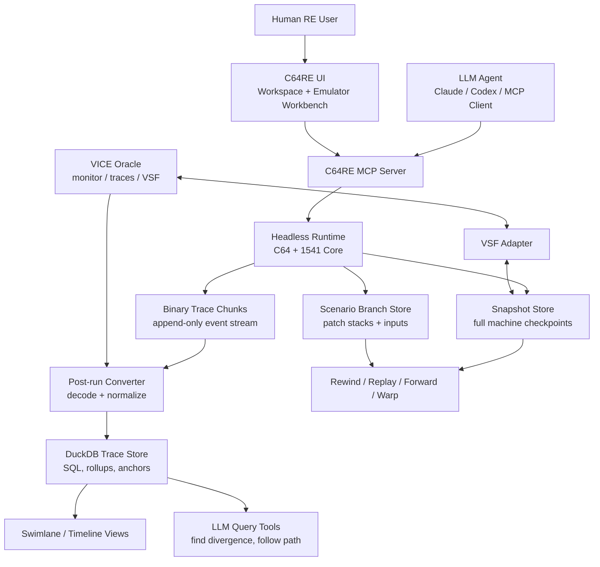
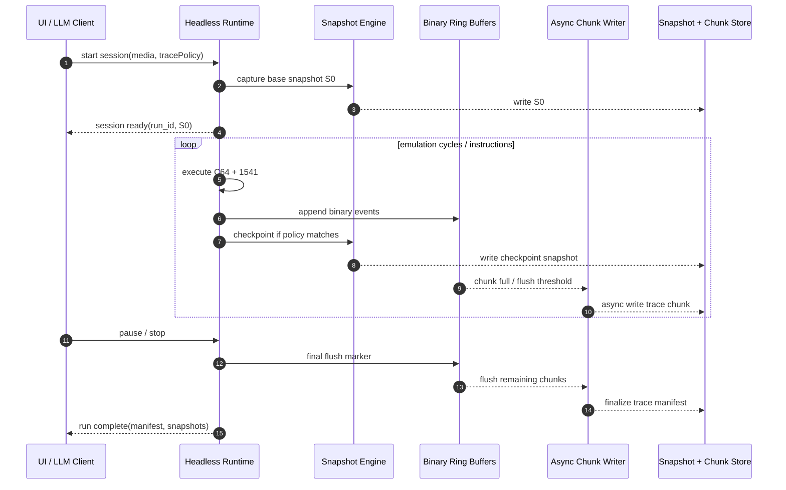
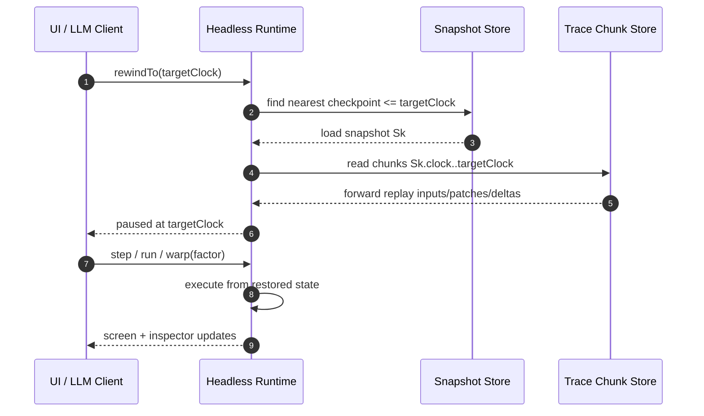
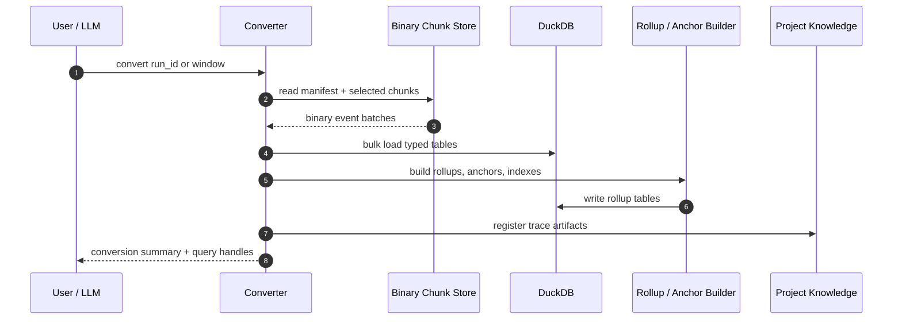
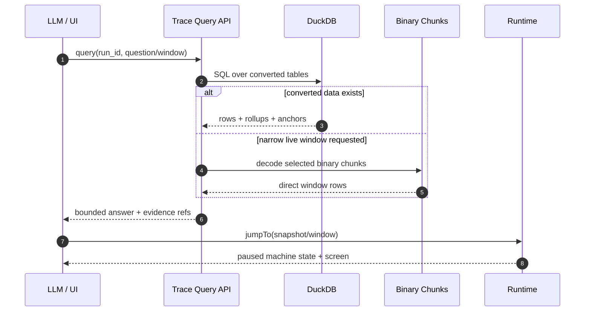
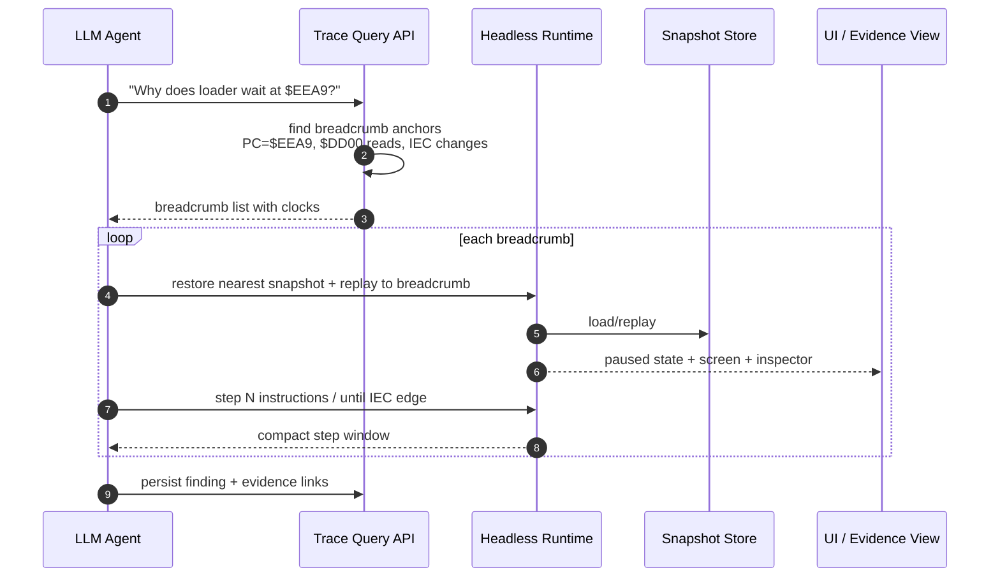
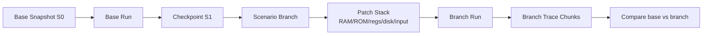
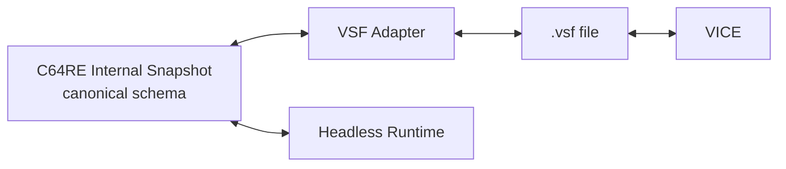
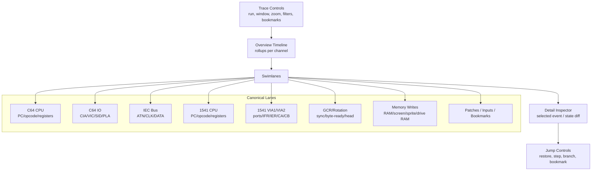

# Epic — Headless Time Travel, Binary Trace Stream, And LLM Runtime Workbench

**Status:** Draft architecture epic  
**Created:** 2026-05-14  
**Scope:** Headless C64/1541 runtime evidence, rewind/replay, snapshots,
scenario branches, trace storage, DuckDB conversion, and UI swimlanes.

## Intent

C64RE should use the Headless Runtime as more than an emulator. The goal is
to let LLMs and humans investigate a C64 program as a deterministic runtime
system:

- pause at an interesting state,
- rewind to an earlier checkpoint,
- branch into a scenario with controlled code/data patches,
- run forward or warp,
- compare the branch against the original,
- convert runtime evidence into durable project knowledge.

The Headless Runtime must therefore produce evidence without damaging the
emulation hot path. DuckDB remains the analytical query store, but not the
per-cycle write sink.

## Core Doctrine

1. **DuckDB is not the runtime hot path.** It is the post-run analytical
   store and query index.
2. **Runtime writes binary append-only chunks.** No JSONL and no relational
   inserts per cycle/instruction.
3. **Time travel is snapshot plus forward replay.** Rewind jumps to the
   nearest checkpoint before the target and replays deltas forward.
4. **Snapshots are emulator truth.** Trace events explain what happened;
   snapshots restore machine state.
5. **Scenario branches are explicit patch overlays.** A branch is not an
   ad-hoc memory mutation. It is a replayable patch stack plus metadata.
6. **VICE Snapshot Format is an adapter.** `.vsf` import/export is required
   for interoperability, but C64RE owns an internal canonical snapshot
   schema.
7. **LLM views are zoomed and bounded.** LLMs should query compact windows,
   breadcrumbs, and swimlanes, not raw multi-gigabyte traces.

## Context Diagram



## Runtime Data Model

### Snapshot

A snapshot is a complete deterministic state image. It must be sufficient
to resume the machine and produce the same future trace, assuming the same
inputs, patches, and media overlays.

Snapshot contents:

- C64 CPU registers, flags, interrupt status, cycle state, pending alarms.
- 64 KiB RAM, color RAM, ROM/RAM/IO banking, PLA / `$01` state.
- VIC-II full internal state, raster state, IRQ state, framebuffer phase.
- CIA1/CIA2 timers, ports, serial state, IRQ/NMI lines, TOD if modeled.
- SID registers and internal emulator state when SID emulation lands.
- IEC bus resolved line state and per-device driver state.
- 1541 CPU, VIA1/VIA2, drive RAM, ROM mapping, interrupt state.
- Drive mechanics: motor, head position, density, byte-ready, sync, GCR
  rotation state, write-protect, media dirty state.
- Disk state by immutable base image reference plus write overlay.
- Scheduler clocks and C64-to-drive clock offset.
- Deterministic RNG/weak-bit seeds.
- Input-device state and pending keyboard/joystick events.

### Delta / Event Stream

Events are not the source of truth for restore. They are the ordered record
of relevant state transitions and trace observations.

Hot-path events should be binary, typed, and append-only:

```text
cpu_step           clk, pc, opcode, a, x, y, sp, p
drive_cpu_step     c64_clk, drive_clk, pc, opcode, a, x, y, sp, p
mem_write          clk, addr, old, value, source
io_write           clk, chip, reg, old, value
io_read            clk, chip, reg, value
iec_line_change    clk, actor, atn, clk_line, data_line
via_event          drive_clk, chip, reg, old, value, irq, ca1, ca2
gcr_event          drive_clk, head_offset, gcr_read, sync, byte_ready
irq_event          clk, source, asserted, vector
input_event        clk, device, kind, value
patch_event        clk, patch_id, target, old, value
snapshot_ref       clk, snapshot_id
bookmark           clk, label, metadata_ref
```

The exact schemas should be compact numeric structs, not JSON objects.

### Binary Trace Chunk

The runtime writer emits chunk files or chunk records:

```text
TraceFile
  Header
    magic = C64RETRACE
    version
    run_id
    machine_profile
    base_snapshot_id
    media_hashes
    channel_dictionary

  Chunk[]
    chunk_header
      start_master_clock
      end_master_clock
      c64_cycle_start
      drive_cycle_start
      event_count
      channel_mask
      compression
      checksum

    payload
      typed binary event records
```

The chunk boundary is a runtime engineering choice. It should be small
enough for responsive UI windows and large enough to avoid excessive file
overhead. Initial target: 1-4 MiB uncompressed payloads or fixed cycle
windows, whichever comes first.

## Record / Store Running Session

This is the primary runtime flow. The emulator must keep real-time and warp
performance while recording enough evidence for later analysis.



### Rewind / Replay / Forward / Warp



Warp is not a trace-store feature. Warp is runtime execution with reduced
UI cadence and buffered trace output.

## Post-Run Conversion

Conversion decodes binary chunks into DuckDB tables, rollups, anchors, and
LLM-ready windows. It can run after stop, in the background while a session
continues, or on demand for a selected time window.



DuckDB tables are optimized for questions, not restore:

- `instructions`
- `drive_instructions`
- `mem_events`
- `io_events`
- `chip_events`
- `iec_events`
- `gcr_events`
- `irq_events`
- `snapshots`
- `patches`
- `bookmarks`
- `rollups`
- `anchors`

## Query Session Data

Queries should support both human exploration and bounded LLM tasks.



Example query families:

- First write/read to address or register.
- All calls into a loader routine.
- First divergence between Headless and VICE traces.
- IEC transaction sequence around `$DD00`.
- Drive code execution between byte-ready edges.
- All memory writes that created the current screen/logo/sprite data.
- Path from BASIC `RUN` to game entrypoint.

## Follow-The-Breadcrumbs Stepping

This is the LLM-native runtime workflow. The LLM asks a concrete question,
the system identifies a small breadcrumb chain, then jumps and steps through
only the relevant windows.



Breadcrumbs should be first-class objects:

```text
breadcrumb
  id
  run_id
  master_clock
  c64_pc
  drive_pc
  channel
  reason
  evidence_refs
```

## Scenario Branches And Patch Overlays

Scenario branches are required for reverse engineering because the user and
LLM need to ask "what if" questions without destroying the base run.



Patch types:

- C64 RAM write.
- Drive RAM write.
- ROM overlay / trap patch.
- CPU register or flag set.
- I/O register override.
- Disk sector or GCR-track overlay.
- Keyboard/joystick/input script.
- Breakpoint action.

Patch events must record old values and target scope so the branch can be
replayed, explained, and undone.

## VSF Import / Export

VICE Snapshot Format is an interoperability layer:



Requirements:

- Export internal snapshots to `.vsf` where all modeled modules are
  supported.
- Import `.vsf` into internal snapshots when module coverage is sufficient.
- Record unsupported VSF modules explicitly.
- Never make VSF the internal state schema.

## Swimlane UI

The UI should make timing visible without forcing users to read raw tables.



UI capabilities:

- Zoom out to rollups; zoom in to event rows.
- Lock two traces side by side: Headless vs VICE, base vs branch.
- Select an event and jump runtime to that clock.
- Add bookmark at selected clock.
- Export selected window as LLM-sized markdown/JSON.
- Show state diff at selected event.
- Show follow-the-breadcrumbs chain as a guided stepping list.

### Example Swimlane — `TREX_splash.asm`

Reference program:
`/Users/alex/Development/C64/Cracking/Accolade comics/EF_Version_C/manual_viewer/TREX_splash.asm`.

The file is useful as a UI example because it has a clear startup sequence,
a persistent music IRQ, and an optional raster-split scroller:

- entry at `$0810`,
- `SEI`, blank screen via `$D011`,
- VIC bank 1 via `$DD00`,
- music init at `$E000`,
- IRQ vector installed at `$FFFE/$FFFF`,
- raster IRQ enabled at `$D012=$F8`,
- splash bitmap mode `$D011=$3B`, `$D018=$18`,
- optional scroller split: top IRQ at `$EE`, bottom IRQ at `$FB`,
  switching `$D011/$D018/$D016` between bitmap and text mode.

The first UI version should be able to render this as a two-lane zoomed
trace around startup and IRQ activity:

Mermaid is not a good fit for this specific view. The intended UI is a
vertical swimlane table: time moves top-to-bottom, columns are independent
lanes, and related events align on the same cycle/raster row.

```text
Cycle / Raster      NON-IRQ lane                                         IRQ1 lane                         VIC lane
-----------------   --------------------------------------------------   -------------------------------   -----------------------------------------
00000000            $0810 SEI                                            -                                 -
00000003            $0811 LDA #$0B     A=$0B X=.. Y=.. SP=.. P=nv-bdIzc  -                                 -
00000005            $0813 STA $D011                                      -                                 $D011 <- $0B, DEN=0, text, blank
00000008            $0816 STA $D020                                      -                                 border <- $00
0000000B            $0819 STA $D021                                      -                                 bg <- $00
0000000E            $081C STA $D015                                      -                                 sprites off
000000xx            ... CIA IRQ mask/ack                                 IRQ sources masked                -
000000xx            STA $01 = $35                                        -                                 PLA/banking state changes
000000xx            STA $DD00 = bank 1                                   -                                 VIC bank = $4000-$7FFF
000000xx            JSR $E000                                            -                                 -
000000xx            STA $FFFE/$FFFF = irq_dispatch                       IRQ vector installed              -
000000xx            STA $D012 = $F8                                      IRQ target raster = $F8            raster compare line <- $F8
000000xx            STA $D01A = $01                                      raster IRQ enabled                IRQ enable <- raster
000000xx            CLI                                                  IRQs live                         -
000000xx            dispatch / splash_phase main loop                    -                                 -

frame N / $F8       interrupted mainline PC shown as resume target        vector fetch -> irq_dispatch      raster=$F8
frame N / $F8       -                                                    STA $D019 = $FF                   $D019 ack
frame N / $F8       -                                                    PHA/TXA/PHA/TYA/PHA               -
frame N / $F8       -                                                    JSR $E003                         SID/music activity elsewhere
frame N / $F8       resumes after RTI                                    RTI                               -

frame M / $EE       mainline paused                                      IRQ1 enter top                    raster=$EE
frame M / $EE       -                                                    STA $D019 = $FF                   $D019 ack
frame M / $EE       -                                                    STA $D011 = $1B                   text mode, DEN=1
frame M / $EE       -                                                    STA $D018 = $16                   screen=$4400 charset=$5800
frame M / $EE       -                                                    STA $D016 = scroll_xpos           XSCROLL=scroll_xpos
frame M / $EE       -                                                    STA $D012 = $FB                   raster compare line <- $FB
frame M / $EE       mainline resumes                                     RTI                               -

frame M / $FB       mainline paused                                      IRQ1 enter bottom                 raster=$FB
frame M / $FB       -                                                    STA $D019 = $FF                   $D019 ack
frame M / $FB       -                                                    STA $D011 = $3B                   BMM=1, DEN=1
frame M / $FB       -                                                    STA $D018 = $18                   screen=$4400 bitmap=$6000
frame M / $FB       -                                                    STA $D016 = $18                   MCM=1 CSEL=1
frame M / $FB       -                                                    JSR $E003; JSR scroller_tick      music + scroll update
frame M / $FB       -                                                    STA $D012 = $EE                   raster compare line <- $EE
frame M / $FB       mainline resumes                                     RTI                               -
```

```text
time/cyc      C64 CPU + Regs + IRQ lane                         VIC lane
-----------   -----------------------------------------------   -----------------------------------------
00000000      PC=$0810  sei                                     raster=?, DEN prior state unknown
00000003      lda #$0b; sta $d011                               $D011=$0B  DEN=0, text, screen blank
000000xx      sta $d020; sta $d021; sta $d015                   border=$00 bg=$00 sprites off
000000xx      sta $dc0d/$dd0d; bit $dc0d/$dd0d                  CIA IRQs masked/cleared
000000xx      lda #$35; sta $01                                 PLA/banking: RAM + IO visible
000000xx      lda/sta $dd00                                     VIC bank=1 ($4000-$7FFF)
000000xx      jsr MUSIC_init ($E000)                            no visible VIC change
000000xx      sta $fffe/$ffff = irq_dispatch                    IRQ vector -> irq_dispatch
000000xx      sta $d012 = $f8; sta $d01a = $01                  raster IRQ line=$F8 enabled
000000xx      cli                                               IRQs live
...
frame N       IRQ1: PC=irq_dispatch, A/X/Y pushed               raster=$F8, $D019 ack
frame N       jsr MUSIC_player ($E003)                          VIC unchanged, SID activity elsewhere
...
frame M       scroller_enable: sta $d012=$EE                    next IRQ top split
frame M+$EE   IRQ1/top: sta $d011=$1B                           text mode for rows 23-24
frame M+$EE   sta $d018=$16; sta $d016=scroll_xpos              charset=$5800, xscroll active
frame M+$EE   sta $d012=$FB; irq_state=1                        next IRQ bottom split
frame M+$FB   IRQ1/bottom: sta $d011=$3B                        bitmap mode restored
frame M+$FB   sta $d018=$18; sta $d016=$18                      screen=$4400 bitmap=$6000
frame M+$FB   jsr MUSIC_player; jsr scroller_tick               scroll_xpos / screen row may change
frame M+$FB   sta $d012=$EE; irq_state=0                        loop split next frame
```

The same data should also be shown as collapsible event cards:

```text
[C64 CPU lane]
  clk 00000000  $0810  SEI
  clk 00000003  $0811  LDA #$0B        A=$0B X=.. Y=.. SP=.. P=nv-bdIzc
  clk 00000005  $0813  STA $D011       write $D011 <- $0B
  ...
  clk ....      IRQ1 enter             vector=$FFFE/$FFFF -> irq_dispatch

[VIC lane]
  clk 00000005  reg $D011: DEN 1->0, BMM=0, yscroll=3
  clk ....      reg $DD00: VIC bank -> bank 1
  clk ....      reg $D012: raster IRQ line -> $F8
  clk ....      reg $D01A: raster IRQ enable -> on
  clk ....      raster $EE: $D011=$1B, $D018=$16, $D016=scroll_xpos
  clk ....      raster $FB: $D011=$3B, $D018=$18, $D016=$18
```

Expected interactions:

- Clicking a CPU instruction highlights the resulting VIC writes.
- Clicking a VIC register write highlights the responsible CPU instruction.
- Clicking `IRQ1 enter` opens a mini trace from IRQ vector fetch to `RTI`.
- Selecting the `$EE → $FB` window opens the raster-split view.
- The LLM export for the selected window contains only the bounded rows
  above plus source labels from the disassembly/listing.

## Proposed Implementation Slices

### Slice A — Snapshot V1

- Define internal snapshot schema and binary/JSON envelope.
- Save/load full Headless state.
- Add deterministic snapshot roundtrip tests.
- Add snapshot manifest and project artifact registration.

### Slice B — Binary Trace Chunk V1

- Define chunk header and channel dictionary.
- Implement allocation-controlled binary ring buffers.
- Implement async chunk writer.
- Record minimal channels: C64 CPU, drive CPU, mem write, IO write, IEC.

### Slice C — DuckDB Converter V1

- Decode binary chunks post-run.
- Bulk-load DuckDB typed tables.
- Build rollups and anchors after import.
- Keep JSONL as debug export only.

### Slice D — Rewind / Replay V1

- Checkpoint snapshots at policy intervals.
- Restore nearest checkpoint and replay forward.
- UI and MCP command: jump to clock, step from there, run from there.

### Slice E — Scenario / Patch V1

- Branch from snapshot.
- Apply patch overlay before run or at breakpoint.
- Record patch events.
- Compare branch trace against base trace.

### Slice F — VSF Adapter

- Map internal snapshot modules to VICE `.vsf`.
- Export modeled subset.
- Import supported modules with explicit unsupported-module report.

### Slice G — Swimlane Workbench V1

- Overview timeline.
- Canonical lane set.
- Event detail inspector.
- Jump/restore/bookmark controls.
- LLM export for selected windows.

## Acceptance Criteria

The epic is complete when:

1. Runtime can record a session without synchronous DuckDB writes.
2. Binary trace chunks are documented, versioned, and replay-safe.
3. Snapshots can restore C64 + 1541 state deterministically.
4. Rewind to a previous clock works via checkpoint plus forward replay.
5. DuckDB conversion is post-run or background, never required for runtime
   progress.
6. LLM can request bounded trace windows and breadcrumb chains.
7. UI has a swimlane timeline that can jump the runtime to selected clocks.
8. Scenario branches can apply patch overlays and record their own traces.
9. VSF import/export exists as an adapter, with unsupported modules reported.

## Non-Goals

- Replacing DuckDB. DuckDB remains the analytical store.
- Running DuckDB as a server.
- Making `.vsf` the internal snapshot format.
- Recording every signal every cycle by default.
- Making JSONL the durable trace format.
- Allowing hidden, unrecorded patches in scenario runs.

## Key Engineering Risks

- Per-event allocation in the hot path.
- Backpressure from async writer into runtime.
- Snapshot incompleteness causing nondeterministic replay.
- Binary schema churn without versioning.
- Trace policies that record too much by default.
- UI queries that pull unbounded windows.
- Branch patches that are not replayable or not attributable.

## Rule For Future Specs

Every implementation spec under this epic must state explicitly:

- whether it touches runtime hot path,
- expected per-event allocation count,
- whether it writes synchronously,
- binary schema version impact,
- snapshot schema version impact,
- DuckDB schema version impact,
- replay determinism test,
- LLM/UI query surface exposed.
