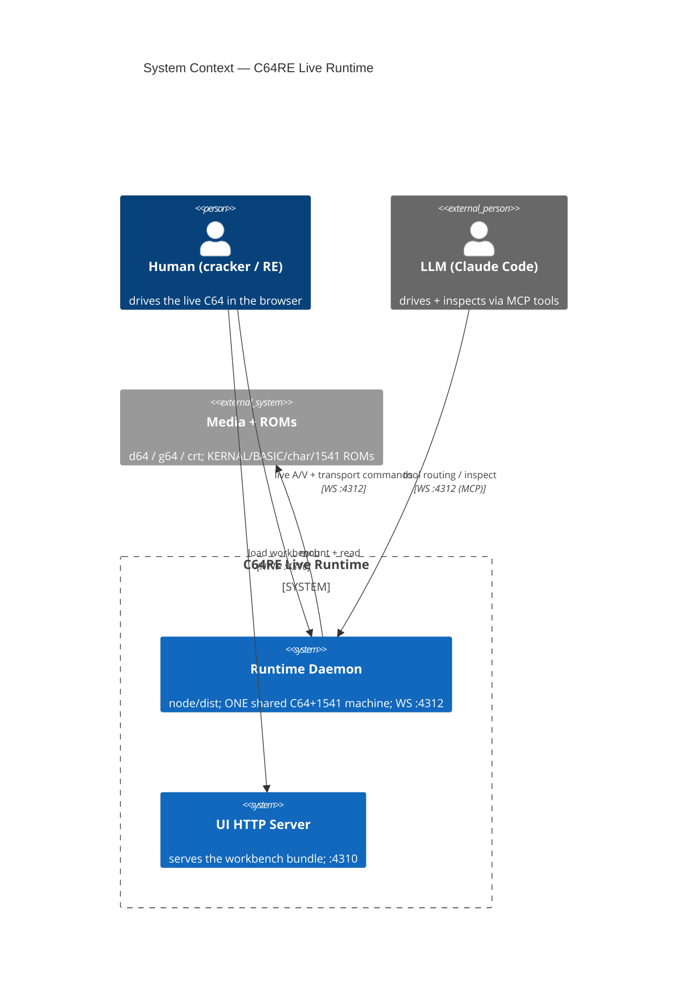
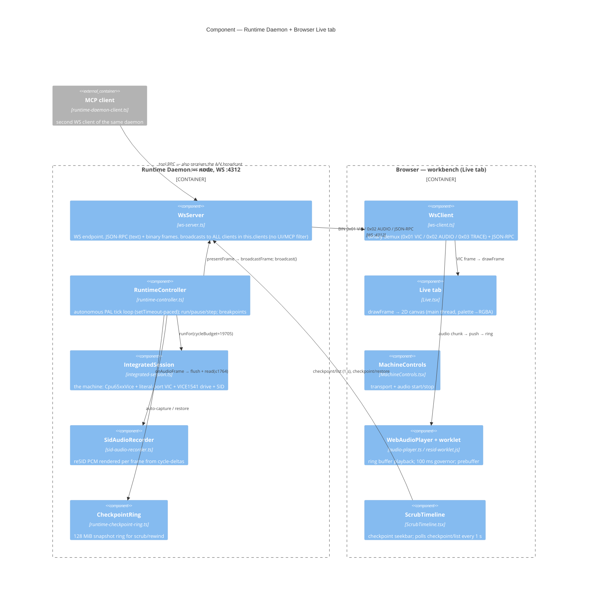
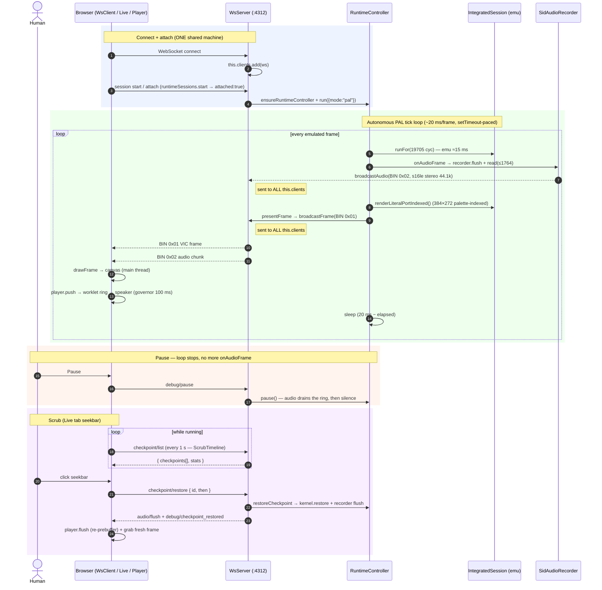

# C64RE Live Runtime — arc42 (daemon ↔ client, Live tab)

Scope: the **live runtime** — the headless C64+1541 daemon, its WebSocket
transport, and the browser workbench Live tab (video + audio streaming, transport
controls, scrub). Complements `vice-iec-arc42.md` (IEC/drive-sync scope) and
`runtime-daemon-solution-design.md` (daemon topology / binding rules).

Drawn to reason about the live/client behaviour deliberately — especially the
per-frame loop and the broadcast fan-out (open: BUG-049 audio stutter, located in
the delivery/hosting path, not the emulation).

> **Backend-scope note (Spec 771):** the **default** runtime backend is now
> **TRX64** (the native Rust daemon). This arc42 describes the in-repo
> **TypeScript** live runtime — the fallback / parity-oracle that powers the
> Live tab. Read the node daemon here as the TS oracle path, **not** the
> product default; VICE remains a correctness oracle only.

---

## §1 Scope

- **One machine per process** (2026-06-12): the runtime core is
  single-machine-per-process; `runtimeSessions.start` *attaches* to the existing
  machine. Human + LLM co-drive the SAME session.
- **Single execution path** (Spec 723): `Cpu65xxVice` + literal-port VIC
  (`vicii_cycle()` per cycle) + event-catchup `VICE1541` drive. No mode toggles.
- **Audio = cycle-delta** (Spec 703): reSID rendered on the BACKEND per emulated
  frame; one server-mixed, uncompressed stream; browser plays via an AudioWorklet
  ring. Confirmed-fine design — do NOT move reSID to the browser.

---

## §3 Context (C4)

The daemon and the UI HTTP server are **two processes**. The browser pulls the
static bundle from `:4310`, then opens a WebSocket to the daemon `:4312` for the
live machine. The MCP (Claude Code) opens its OWN WebSocket to the same daemon
`:4312` — it is a second client of the one shared machine.

---

## §5 Building Blocks (C4 Component)

Key fan-out fact: `broadcastFrame` / `broadcastAudio` iterate **`this.clients`**
(`ws-server.ts` — every connection is added in `onConnection`, no UI-vs-MCP
filter). So every connected WS client receives the full 50 fps A/V stream.

---

## §6 Runtime View — Live tab sequence (daemon ↔ client)

---

## §6.1 Notes to reason with

- **Audio + video share ONE WebSocket and ONE per-frame broadcast loop**, sent to
  **every** client (browser + MCP). No client opts out of the firehose.
- **Audio is slaved to the emulated frame rate** (one PCM chunk per `onAudioFrame`,
  generated from elapsed cycles). If the loop can't sustain 50 fps wall-clock, audio
  is under-delivered → the worklet ring drains → underrun.
- **The emulation is ~15 ms of the 20 ms frame budget** (literal-port per-cycle VIC
  + VICE1541 drive). Headroom for present + audio-ship + WS + GC is ~5 ms. Measured
  identical at 706-perfect (14.27 ms) and now (15.18 ms) — so emu speed is a
  constant, not the BUG-049 regression.
- **BUG-049 root cause (found 2026-06-15):** the always-on checkpoint capture ran
  HEAVY work on the emu thread every second — a full ~317 KiB framebuffer copy +
  3× sha256 of the ~1 MiB EF cartridge image (to decide dedup). That stole the
  per-frame budget → under-delivered audio → underrun ("kratzen"), and dragged fps
  to 43-47. The framebuffer is a derivable shadow (regenerated by re-sim on
  restore) and the medium is constant (its O(1) generation tells us when it
  changed) — so NEITHER should be touched on the hot path. (Plus a 180 ms worklet
  cushion, shipped + accepted.)

## §6.2 The Recorder (Spec 766 — replaces inline ring capture)

The fix model (user-ratified): the checkpoint/anchor recorder is a **data-stream
into Runtime-owned shared memory**, NOT inline work on the tick loop.

- **Tick loop** = fire-and-forget producer: `memcpy` (timestamp, RAM, flat chip
  scalars, IO, + medium ONLY when its O(1) generation moved) into a
  `SharedArrayBuffer` ring + advance an `Atomics` write-cursor. No read, no hash,
  no GC. (The framebuffer is omitted — derivable.)
- **Async worker** (`worker_thread`, same pattern as the 726.B binary-firehose
  worker) = drains the ring and does ALL heavy work: delta-encode anchors, dedup
  the medium by generation, compact + index, and serve the UI/MCP evaluation API.
- The 128 MiB is **never read/evaluated on the emu thread**. Coarse scrub =
  restore an anchor (worker API) + run one frame to repaint. Fine stepping = the
  separate CPU firehose / "⏺ Trace" + the `.c64re`-dump-from-anchor → replay-with-
  trace flow (726.B / 746 / 707). See `specs/_archive/766-runtime-recorder-shared-memory-streaming.md`.
  Spec 765 (the in-process flat ring) is the superseded interim.

---

## §7 References

- `src/runtime/headless/daemon/run.ts` — daemon entry (node/dist; tsx = 12× slower).
- `src/workspace-ui/ws-server.ts` — `WsServer`, `broadcastFrame`/`broadcastAudio`/
  `broadcast`, `onConnection` (clients.add), `pushFrame`.
- `src/runtime/headless/debug/runtime-controller.ts` — `tick()` loop, `run`/`pause`,
  `onAudioFrame`, `maybePresentFrame`, checkpoint ring.
- `src/runtime/headless/integrated-session.ts` — the machine + `renderLiteralPortIndexed`.
- `src/runtime/headless/audio/sid-audio-recorder.ts` + `audio-buffer.ts` — reSID PCM.
- `ui/src/workbench/ws-client.ts` — binary demux.
- `ui/src/workbench/tabs/Live.tsx` — `drawFrame` / canvas.
- `ui/src/workbench/components/MachineControls.tsx` + `audio-player.ts` +
  `resid-worklet.js` — audio path.
- `ui/src/workbench/components/ScrubTimeline.tsx` — scrub seekbar.
- `scripts/workspace.mjs` / project `ui.sh` — launch (HTTP :4310 + WS :4312).
- `specs/_archive/766-runtime-recorder-shared-memory-streaming.md` — the Recorder (§6.2);
  `specs/765-*` (superseded interim); `specs/746-*` (anchor+firehose charter).
