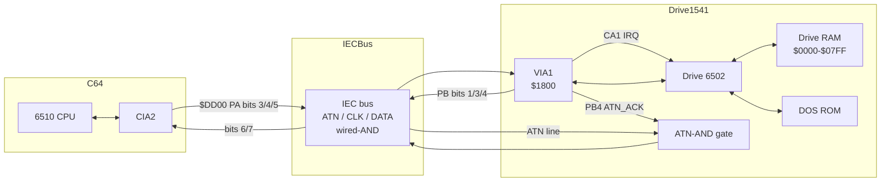

# VICE IEC + drive-sync arc42 deep-dive

**Status**: draft v1 — produced under Spec 137.

**Architectural status update (post-doc)**: After this doc landed, the
project moved to a kernel-level reframing in
`docs/headless-core-synchronization-refactor.md`. That refactor doc
takes the divergences cataloged here and pulls them under a coherent
kernel-rewrite plan (Sprint 112 / Specs 139-144). In particular:

- ADR-1 (push-flush) → Spec 140 (cache+flush, default).
- ADR-2 (cache ports) → Spec 140 (default, not fallback).
- ADR-3 (IRQ rclk) → Spec 141.
- ADR-4 (`$7C` poke removal, `reevaluateCa1Level`) → Spec 144.

Spec 138 still exists but is now a **probe / experiment** that runs
after Spec 142 (trace ring) and Spec 143 (VICE diff), to validate
whether push-flush alone closes the motm divergence. Probe-result
informs Spec 140's exact design (cache+flush combined vs flush only).
This doc remains the catalog of *local* divergences; the refactor doc
is the *global* architectural answer.

**Scope**: I/O surface only. ATN / CLK / DATA on the IEC bus, the
C64↔1541 sync model (push-flush vs cycle-lockstep), VIA1 CA1 → drive
IRQ handler delivery. Out of scope: 1571/1581/CMD-HD specifics, VIC,
SID, parallel cable, JiffyDOS. Burst mode covered briefly in §5.8 as
a parallel-path note.

**Companion docs** (added 2026-05-11):
- `vice-c64-arch.md` — full C64 (x64sc) emulation architecture.
- `vice-1541-arch.md` — full 1541 drive emulation architecture.

This doc is the canonical description of **the interplay** between the
two. It also contains a divergence catalog vs an older internal
headless implementation, kept for historical value. Sections marked
"**[clone-relevant]**" describe VICE behavior that any new emulator
must match. Sections marked "**[divergence]**" describe historical
deltas of the headless code.

**Verification status** (2026-05-11): all VICE-side claims in §5 and
§6 were re-verified against the in-tree `vice/src/` source. Source
matches doc except for two cosmetic notes added in §5.1 (formula
distributive expansion) and §5.9 (non-1541 drv_bus formula variants).

**Reference codebases**:
- VICE 3.7.1 source at `…/vice-3.7.1/src/`
- Our headless at `src/runtime/headless/`

**Why this doc exists**: Sprint 111 hit a ceiling. Eleven commits of
speculative patching could not localize the motm-fastloader bug
(drive's `BIT $1800` returns wrong DATA bit during 24-bit serial
receive at $042F-$044C). Two reverted fix attempts (Sprint 66 hack
removal — neutral, `beforeC64Read` inserted into lockstep — broke MM).
Hypothesis: our drive↔C64 sync model is **not 1:1 with VICE**; without
a structured comparison every fix attempt is guess-driven.

This doc maps VICE's IEC + drive-sync architecture to ours, with
sequence diagrams, divergence-table, and an ADR list ranked by
impact:effort. The top ADR becomes Spec 138.

---

## §1 Introduction

The IEC serial bus is the bridge between the C64 (host) and the 1541
(intelligent peripheral). It is open-collector wired-AND with three
active lines (ATN, CLK, DATA) plus a fourth ATN-acknowledge AND-gate
inside the drive. Both sides drive the bus at arbitrary times; the
emulator must keep their views of the bus consistent.

The IEC bus is also where most fastloaders live. Standard KERNAL is
slow (~400 bytes/sec); fastloaders bypass KERNAL with custom bit-bang
protocols that depend on **cycle-precise** drive↔C64 timing. The
1541 drive runs its own 6502 at ~1.0149× the C64's clock, so a
correct emulator must keep two CPUs in sync to within a few cycles.

VICE solved this with an alarm-driven, push-flush model: the drive
runs lazily and is force-flushed up to the current C64 clock at every
IEC bus access. We chose a cycle-lockstep model instead: every C64
cycle, peripherals tick, then the drive ticks. Both models are
plausible. The question is whether ours faithfully reproduces VICE's
observable behavior at the bus interface — and the motm bug suggests
not.

---

## §2 Constraints

- **Real 1541 ROM**: We use the unmodified DOS 1541 ROM
  (`dos1541-325302-01+901229-05.bin`). Any deviation from VICE that
  changes ROM-visible state is suspect.
- **VICE-derived runtime code is GPL**: The current project license is
  GPL-3.0-or-later. Runtime modules may port VICE behavior and code shape
  directly when that is the safest way to preserve correctness. Such ports
  must document the VICE source file/function they derive from.
- **Cycle-stepped 6502 in the drive**: The microcoded CPU
  (`Cpu6510Microcoded`) is required for IEC correctness because the
  drive samples bus state mid-instruction (operand fetch, indexed
  effective-address read, RMW write).
- **Headless-first**: Bug fixes must keep MM regression tests green
  (loads boot through SYS, reaches title screen).

---

## §3 Context



The C64 owns ATN absolutely (only it can drive ATN). CLK and DATA are
shared (both sides can pull). The drive's PB4 (ATN_ACK) feeds an
external AND gate that auto-pulls DATA whenever ATN is asserted and
the drive has not yet acknowledged. CA1 fires the drive's IRQ when
ATN edges from high to low.

---

## §4 Solution Strategy

We compare VICE and ours per component (§5), trace six runtime
scenarios end-to-end with sequence diagrams (§6), tabulate the
cross-cutting timing model (§8), and rank divergences as ADRs (§9).
The top ADR drives Spec 138 (concrete fix).

---

## §5 Building Blocks

### §5.1 iecbus (`src/iecbus/iecbus.c` + `src/c64/c64iec.c`)

**Purpose**: Owns the global `iecbus_t` state. Routes C64 stores/reads
of `$DD00` (CIA2 PA) into bus-state recomputation and drive flush.

**State** (`iecbus_t`):
- `cpu_bus` (uint8_t): C64's current pull pattern, derived from PA bits
  via `iec_update_cpu_bus()`. Bits 4/6/7 carry ATN/CLK/DATA. Updated
  only on $DD00 store.
- `cpu_port` (uint8_t): Effective bus state as seen by the C64. Equals
  `cpu_bus AND-folded with drv_bus[4..NUM_DISK_UNITS]`. CIA2 reads of
  `$DD00` return this byte.
- `drv_port` (uint8_t): Effective bus state as seen by the drive. VIA1
  PRB read folds it in via `((PRB & 0x1A) | drv_port) ^ 0x85`.
- `drv_bus[16]` (uint8_t[]): Per-unit drive contribution to the bus,
  precomposed with the ATN-AND-gate logic.
- `drv_data[16]` (uint8_t[]): Raw drive PB output (inverted), used to
  recompute `drv_bus` whenever `cpu_bus` changes.
- `iec_fast_1541` (uint8_t): Burst-mode bits, irrelevant here.

**Interfaces**:
- `iec_update_cpu_bus(data)` — `cpu_bus = ((data<<2)&0xC0) | ((data<<1)&0x10)`
- `iec_update_ports()` — recompute `cpu_port` and `drv_port` from
  `cpu_bus` AND `drv_bus[]`
- `iecbus_cpu_read_conf1(clock)` — drive_cpu_execute_all(clock); return cpu_port
- `iecbus_cpu_write_conf1(data, clock)` — drive_cpu_execute_one(unit,
  clock); update_cpu_bus; viacore_signal(CA1) if ATN edge; recompute
  drv_bus[8]; update_ports

**Our equivalent**: `src/runtime/headless/iec/iec-bus.ts:IecBus`.

| VICE | Ours |
|------|------|
| `cpu_bus` (cached) | `c64{Atn,Clk,Data}Released` flags (live) |
| `drv_data[8]` | `drive{Clk,Data}Released`, `driveAtnAckReleased` |
| `drv_bus[8]` | computed inline in `dataLine` getter |
| `cpu_port` cached | `clkLine`/`dataLine` computed live each read |
| `drv_port` cached | `buildDrivePbInputBits()` builds live each read |
| `iec_update_cpu_bus()` | `setC64Output()` |
| `iec_update_ports()` | implicit (no caching) |

**Divergence flags**:
- ⚠️ **D1**: VICE caches `cpu_port` and `drv_port`. Ours computes live.
  Real HW is "live" by definition (continuous wires), so ours is closer
  to physical reality — but this means VICE's read-side flush
  semantics (drive_cpu_execute_all before returning cpu_port) is what
  guarantees the cache is fresh. We need an equivalent guarantee for
  *drive's* read of `drv_port`.
- ⚠️ **D2**: VICE only recomputes ports on (a) $DD00 store, (b) drive
  PB store, (c) explicit calls to `iec_update_ports`. Reads do *not*
  trigger recompute — they just return the cached byte after flushing
  the drive. Ours has no such asymmetry.

### §5.2 c64iec (`src/c64/c64iec.c`)

Thin layer with `iec_update_cpu_bus()` and `iec_update_ports()`
implementations. The interesting bit is the formula:

```c
iecbus.cpu_port = iecbus.cpu_bus;
for (unit = 4; unit < 8 + NUM_DISK_UNITS; unit++)
    iecbus.cpu_port &= iecbus.drv_bus[unit];

iecbus.drv_port = (((iecbus.cpu_port >> 4) & 0x4)
                  | (iecbus.cpu_port >> 7)
                  | ((iecbus.cpu_bus << 3) & 0x80));
```

`drv_port` is composed from the *post-AND* `cpu_port` (so the drive
sees the consequence of its own pull, plus the C64's pull, plus other
drives), but the ATN bit (`drv_port` bit 7) comes from `cpu_bus` —
ATN is C64-only.

The wired-AND happens at byte granularity per bit:
- `cpu_port >> 7` extracts bit 7 (DATA) → drv_port bit 0 (DATA_IN)
- `(cpu_port >> 4) & 0x4` extracts bit 6 (CLK) → drv_port bit 2 (CLK_IN)
- `(cpu_bus << 3) & 0x80` extracts cpu_bus bit 4 (ATN intent) → drv_port bit 7

**Our equivalent**: `iec-bus.ts:dataLine`/`clkLine` getters and
`buildDrivePbInputBits()`. Bit-wise equivalent to VICE's formulas
modulo the cache vs live distinction.

### §5.3 CIA2 (`src/c64/c64cia2.c`)

The C64 CIA2 PA latch is the bridge from CPU memory writes to the
IEC. Our `cia2-stub.ts` registers a callback into IecBus on $DD00
write/read.

**VICE store flow**:
- `cia2_store_pra(cia, byte)` → CIA latches PA → `iecbus_callback_write(byte, maincpu_clk)`
- The callback is `iecbus_cpu_write_conf1` (configured at startup).

**VICE read flow**:
- `cia2_read_pra(cia)` → reads `iecbus_callback_read(maincpu_clk)`
- Callback is `iecbus_cpu_read_conf1`, which flushes drive then
  returns `iecbus.cpu_port`.

The crucial detail: CIA2's PA *write* is unconditional (the CIA does
not depend on the IEC return value), but CIA2's PA *read* must return
the live wire state — hence VICE's drive flush on every read.

### §5.4 drivecpu (`src/drive/drivecpu.c`)

**VICE drive CPU execution model**:
- `drivecpu_execute(drv, clk_value)`:
  1. `cycles = clk_value - cpu->last_clk` (= main CPU clocks elapsed)
  2. Convert to drive cycles using fixed-point `sync_factor`:
     `cpu->cycle_accum += sync_factor * tcycles; cpu->stop_clk += accum >> 16`
  3. Run drive 6502 inline (via `6510core.c` macro-included) until
     `*drv->clk_ptr >= cpu->stop_clk`
  4. `cpu->last_clk = clk_value` (commit)
- Wrapped by `drive_cpu_execute_all(clock)` and
  `drive_cpu_execute_one(unit, clock)`.

**Push-flush invariant**: At every C64-side access of `$DD00` or
`$DC0D` (CIA2 ICR), VICE calls `drive_cpu_execute_all(maincpu_clk)`
*before* doing anything bus-related. After this call, the drive's
clock has caught up to the C64. Then VICE updates the bus, optionally
triggers CA1, and recomputes ports. The drive's NEXT instruction will
see the updated bus state.

**Our equivalent**: `drive-cpu.ts:DriveCpu.executeToClock(c64Clk)` +
the cycle-lockstep scheduler (`cycle-lockstep-scheduler.ts`).

| VICE | Ours |
|------|------|
| `cpu->last_clk` | `lastSyncC64Clk` |
| `cpu->stop_clk` | computed inline, drive runs until consumed |
| `cpu->cycle_accum` | `cycleAccumulator16dot16` |
| `sync_factor` (16.16) | `syncFactor16dot16` |
| `drivecpu_execute` | `executeToClock` |
| Push from c64 IEC access | Pull per-cycle from scheduler |

**Divergence flags**:
- ⚠️ **D3**: VICE's drive CPU is in **push** mode — the c64 side
  decides when to flush it. Ours runs in **pull** mode — every C64
  cycle the scheduler ticks the drive its share (via 16.16
  accumulator). The schedules are **not equivalent** at sub-instruction
  granularity. VICE's drive runs in chunks of "everything between two
  c64 IEC accesses." Ours runs every cycle.
- ⚠️ **D4**: VICE explicitly defers drive flush to bus-access points.
  This means within a c64 instruction that does NOT touch IEC, the
  drive does not advance at all; it catches up at the next IEC access.
  Ours advances every cycle. For most code this is fine, but for
  fastloaders that read $DD00 in tight loops, VICE's drive sees each
  read as a discrete "wake point" where it has just finished an
  instruction; ours sees the drive in arbitrary mid-instruction states.

### §5.5 via1d1541 (`src/drive/iec/via1d1541.c` + `src/core/viacore.c`)

**VICE store_prb** (drive writes $1800):
```c
*drive_data = ~byte;
*drive_bus = ((drive_data << 3) & 0x40)
           | ((drive_data << 6) & ((~drive_data ^ cpu_bus) << 3) & 0x80);
iecbus.cpu_port = cpu_bus & AND(drv_bus[*]);
iecbus.drv_port = compose_from(cpu_port, cpu_bus);
```

**VICE read_prb** (drive reads $1800):
```c
byte = ((via->PRB & 0x1A) | iecbus.drv_port) ^ 0x85 | orval;
```

The XOR with `0x85` inverts ATN_IN (bit 7), DATA_OUT (bit 1, but PRB
bit), and DATA_IN (bit 0) — folding the 1541's input-side inverters
into one mask. `0x1A` mask preserves PB bits 1, 3, 4 (DATA_OUT,
CLK_OUT, ATNA) from the OR latch (the bits the drive *drove out* —
they read back through DDR).

**viacore_signal(via, line, edge)**:
- `case VIA_SIG_CA1`: if `(edge ? 1 : 0) == (PCR & 0x01)` → set
  `IFR_CA1`, then `update_myviairq_rclk(via, *clk_ptr)`.
- The `edge` argument is a *polarity tag*, not a direction: 0 means
  "I just observed a falling edge", `VIA_SIG_RISE` (=1) means rising.
  IFR is set only if the observed edge matches PCR config.
- The IFR set is followed by `update_myviairq_rclk` which calls
  `set_int(via, num, value, rclk)` — stamps the IRQ event with the
  current clock for the interrupt-delay model in `interrupt.c`.

**iecbus.c calls viacore_signal**: At ATN-bit transitions only:
```c
viacore_signal(via1d1541, VIA_SIG_CA1,
               iec_old_atn ? 0 : VIA_SIG_RISE);
```
- `iec_old_atn` was just updated to the new `cpu_bus & 0x10`.
- New ATN asserted (cpu_bus bit 4 set, line LOW): pass `0` →
  signals "falling edge just happened" → IFR_CA1 set if PCR config
  is negative-edge.
- New ATN released (cpu_bus bit 4 clear, line HIGH): pass
  `VIA_SIG_RISE` → IFR_CA1 set only if PCR config is positive-edge.

The DOS 1541 ROM configures CA1 for negative-edge (PCR & 0x01 = 0),
so IRQ fires on ATN H→L transition.

**Our equivalent**: `via6522.ts:Via6522.pulseCa1(newLevel)`. Edge-only
on actual transition.

```ts
if (!polarity && wasHigh && !isHigh) this.setIfr(IFR_CA1);
if (polarity && !wasHigh && isHigh) this.setIfr(IFR_CA1);
this.lastCa1Pin = isHigh;
```

| VICE | Ours |
|------|------|
| `viacore_signal(CA1, edge)` | `pulseCa1(newLevel)` |
| Polarity tag (0/RISE) | Live transition detect |
| `update_myviairq_rclk(rclk)` | Inline IFR set, irqLine sampled per cycle |
| `interrupt_check_irq_delay` | Microcoded CPU samples at instr boundary |

**Divergence flags**:
- ⚠️ **D5**: VICE timestamps IRQ events with `rclk = maincpu_clk`,
  then `interrupt_check_irq_delay` enforces `cpu_clk >= irq_clk +
  INTERRUPT_DELAY` (= 2 cycles default). Drive's IRQ entry is delayed
  by at least 2 drive cycles after the IFR was set on c64-side.
- ⚠️ **D6**: Ours sets IFR immediately on the c64-side cycle. The
  microcoded drive CPU samples `irqLine` at instruction boundary; if
  the drive is mid-instruction when the IFR fires, IRQ entry happens
  at the next boundary. The latency depends on where in the
  instruction the drive was at the c64 store — could be 0..6 drive
  cycles. *VICE's 2-cycle delay is deterministic; ours is not.*
- ⚠️ **D7**: We have a Sprint 66 leftover (`reevaluateCa1Level`)
  that sets IFR_CA1 retrospectively if CA1 is enabled in IER while
  ATN is asserted. VICE has no equivalent — VICE assumes the drive
  ROM enables CA1 IER before the C64 asserts ATN (which is what the
  real boot order guarantees). Our reset puts both CPUs at t=0
  simultaneously; VICE keeps the drive ROM running for ~10 PAL
  frames before the C64 KERNAL even starts. This is an architectural
  divergence we should fix at the boot-order layer, not paper over
  with a CA1 hack.

### §5.6 Alarm system (`src/alarm.c`)

**VICE**: Pending events (T1 zero, T2 zero, alarm callbacks) are
queued on a per-CPU alarm context, sorted by clock value. Each CPU's
inner loop pops alarms whose `clk <= current_clk` and runs them.
Drive CPU has its own alarm context; main CPU has another.

**Our equivalent**: **None**. We tick T1/T2 per cycle in
`Via6522.tickTimer1`/`tickTimer2`. Bus state is computed live. CA1
edges are immediate.

| VICE | Ours |
|------|------|
| Alarm context per CPU | Per-cycle tick |
| T1/T2 zero scheduled | T1/T2 counted down each cycle |
| CA1 IRQ stamped + delayed | CA1 IRQ immediate |

**Divergence flags**:
- ⚠️ **D8**: VICE's T1 zero alarm fires at a *known* future clock,
  not necessarily at the cycle when the counter would visually hit
  zero. The 2-cycle interrupt delay then determines the boundary at
  which the CPU sees IRQ. Our per-cycle tick reaches T1=0 at the
  expected cycle, but our IRQ observation is whatever-cycle-the-CPU-
  gets-to-instruction-boundary, which may differ from VICE.

### §5.7 maincpu_clk and drive clk_ptr

VICE has two distinct global clocks (`maincpu_clk` and per-drive
`*drv->clk_ptr`). The drive's clk_ptr advances inside
`drivecpu_execute` until it catches up to the requested c64 clock.

Our equivalents: `c64Cpu.cycles`, `drive.cpu.cycles`,
`scheduler.c64Cycle()`, `scheduler.driveCycle()`. The scheduler
keeps these in sync via the 16.16 accumulator on every tick.

**Divergence flags**:
- ⚠️ **D9**: VICE allows the drive clock to *lag* the C64 clock between
  bus accesses (intentional — the push-flush model resolves it). Ours
  enforces lockstep. For most code this is fine; for ATN-edge-driven
  IRQ entry it matters because the IRQ stamp `rclk = maincpu_clk` is
  in *C64 cycles*, but the drive's interrupt-delay check uses *drive
  cycles*. VICE handles the conversion via the cycle ratio when the
  drive catches up; we don't have that conversion because we don't
  defer.

### §5.8 Burst mode (`src/c64/c64fastiec.c`) **[clone-relevant]**

Originally out of scope; added here for completeness, since any
emulator that aims to run JiffyDOS / SpeedDOS / Action Replay 6 needs it.

**What it is**: a parallel-path "fast IEC" using shift registers
instead of bit-bang on CLK/DATA. 1541 doesn't support burst natively
(no SDR on VIA1 PB), but 1571 and 1581 do via CIA. Several C64 ROM
replacements (JiffyDOS, SpeedDOS+) implement burst-compatible
fastloaders using the **C64's CIA1 or CIA2 SDR** + a custom serial
protocol on the drive side.

**Wiring**:

- C64 side: `c64fastiec.c` has a `burst_mod` resource selecting
  `BURST_MOD_NONE` / `BURST_MOD_CIA1` / `BURST_MOD_CIA2`. When CIA1
  or CIA2 is selected, that CIA's SDR is rerouted to drive
  communication.
- Drive side: VIA1 SDR (CIA1571 in 1571) is hooked to the C64's
  selected CIA via:
  - `c64fastiec_fast_cpu_write(data)` — C64 writes SDR → flush drive
    → set drive SDR
  - `iec_fast_drive_direction(dir, dnr)` — set drive transmit/receive

**Call sites** (write):
- `cia1_store_sdr()` in `src/c64/c64cia1.c` — if `burst_mod == CIA1`,
  call `c64fastiec_fast_cpu_write(byte)`.
- `cia2_store_sdr()` in `src/c64/c64cia2.c` — same for CIA2.

**Call sites** (read direction setup):
- `cia1_store_pra/prb/cra` — when CIA CNT pin direction flips, calls
  `iec_fast_drive_direction()`.

**Flush behavior**: same push-flush as plain IEC — burst writes call
`drive_cpu_execute_all(maincpu_clk)` before mutating drive SDR.

**Clone advice**: implement burst as a *separate code path*. Don't
try to unify with bit-bang IEC at the bus level — the data crosses
via CIA SDR↔VIA SDR, not via wired-AND CLK/DATA. The bit-bang IEC
path remains active concurrently (ATN handshake still uses it).

### §5.9 Non-1541 `drv_bus` formula table **[clone-relevant]**

The doc's §5.5 shows the 1541 formula:

```c
*drive_bus = ((data << 3) & 0x40)
           | ((data << 6) & ((~data ^ cpu_bus) << 3) & 0x80);
```

**This is 1541-specific.** Other drives in the family use different
formulas because the ATN-AND gate is wired differently (or absent):

| Drive | File | Formula skeleton |
|---|---|---|
| 1541 / 1541-II | `src/drive/iec/via1d1541.c:230-232` | `((data<<3)&0x40) \| ((data<<6) & ((~data ^ cpu_bus)<<3) & 0x80)` |
| 1581 / CMD-HD | `src/iecbus/iecbus.c:275-278` (configurable handler) | `((data<<3)&0x40) \| ((data<<6) & ((data \| cpu_bus)<<3) & 0x80)` |
| 2000 / 4000 | (CBM-II/PET path, in `src/iecieee/`) | different — IEEE-488 not IEC |

The 1541 formula uses `(~data ^ cpu_bus)` to model the discrete
**ATN-AND gate** (a 74LS00 quad NAND in real hardware): the gate
auto-pulls DATA whenever ATN is asserted AND the drive has not yet
acknowledged (set ATNA = PB.4 high). On 1581 there is no such gate
(ATN ack is software-only via VIA), so the formula uses `(data | cpu_bus)`
instead.

For a clone: implement the right formula per drive type. The 1541
formula will NOT make 1581 work and vice versa.

### §5.10 `interrupt_check_irq_delay` semantics **[clone-relevant]**

From `src/interrupt.c` / `src/interrupt.h:61`:

```c
#define INTERRUPT_DELAY 2
```

The exact mechanism inside `interrupt_check_irq_delay`:

```c
/* pseudocode, faithful to interrupt.c logic */
if ((global_pending_int & IK_IRQ)
    && cpu_clk >= irq_clk + INTERRUPT_DELAY) {
    /* and: I flag clear, not in mid-CLI/SEI delay */
    return TAKE_IRQ;
}
```

`irq_clk` is the **drive clock** at which the most-recent IFR-set
happened (stamped by `update_myviairq_rclk` in `viacore.c:203`). The
2-cycle delay is in **drive cycles**.

When the C64 asserts ATN at `maincpu_clk = T`:
1. Push-flush brings drive clock to `(T - last_clk) * sync_factor + drive_last_clk`.
2. `viacore_signal(CA1)` sets IFR_CA1, stamps `irq_clk = *drv->clk_ptr`.
3. Drive returns from flush. Drive 6502 continues from instruction
   boundary at next call to `drivecpu_execute()`.
4. At each instruction boundary, `interrupt_check_irq_delay` runs.
   First boundary satisfying `*clk_ptr ≥ irq_clk + 2` triggers IRQ
   entry (7-cycle sequence, all on drive clock).

**Net latency** between C64 STA $DD00 (ATN assert) and drive
executing first instruction of $FE67 IRQ handler: roughly
(remaining cycles of current drive instruction) + 2 + 7 = 9-13 drive
cycles ≈ 9-13 host cycles.

For a clone: this stamp+delay protocol is the deterministic model.
A pull-mode lockstep emulator without it has non-deterministic
latency 0-6 drive cycles (depending on where in its instruction the
drive happens to be at IFR-set time). Both can boot games; only the
former matches VICE exactly.

### §5.11 Complete C64-side call-site enumeration **[clone-relevant]**

Every place in VICE C64 code that triggers a drive flush /
`drive_cpu_execute_all` / `drive_cpu_execute_one`:

| Site | Why flush | What follows |
|---|---|---|
| `cia2_read_pra()` in `c64cia2.c:213` | IEC PA read needs current bus state | Returns `iecbus.cpu_port` |
| `cia2_store_pra()` in `c64cia2.c:162` | Via callback `iecbus_cpu_write_conf1` | ATN edge check, bus mutation |
| `cia1_read_sdr/icr()` (if burst_mod=CIA1) | Burst SDR depends on drive state | Returns SDR or ICR |
| `cia2_read_sdr/icr()` (if burst_mod=CIA2) | Same for CIA2 burst | Same |
| `c64fastiec_fast_cpu_write()` | Burst write requires drive sync | Stores into drive SDR |
| Parallel cable (`c64parallel.c`) writes | DolphinDOS / SpeedDOS via user port | Mutates drive PRA |
| `c64_snapshot_write()` in `c64-snapshot.c` | Pre-snapshot consistency | Save drive module |
| Monitor commands | Manual drive inspection | Debug only |

**Crucial**: at every one of these sites, `drive_cpu_execute_all`
runs **before** any state mutation. The invariant "drive is at
instruction boundary at every observable C64 IEC event" is
maintained by this discipline.

**Verified call-site set (2026-05-11 against vice/src/)**:

| File:line | Function | Flush call |
|---|---|---|
| `src/iecbus/iecbus.c:241` | `iecbus_cpu_write_conf1` (single-drive write path) | `drive_cpu_execute_one(unit, clock)` |
| `src/iecbus/iecbus.c:229` | `iecbus_cpu_read_conf1` (single-drive read path) | `drive_cpu_execute_all(clock)` |
| `src/iecbus/iecbus.c:304` | `iecbus_cpu_write_conf2` (drive 9 write) | `drive_cpu_execute_one(unit, clock)` |
| `src/iecbus/iecbus.c:292` | `iecbus_cpu_read_conf2` (drive 9 read) | `drive_cpu_execute_all(clock)` |
| `src/iecbus/iecbus.c:368` | `iecbus_cpu_write_conf3` (multi-drive/virtual write) | `drive_cpu_execute_all(clock)` + `serial_iec_device_exec(clock)` |
| `src/iecbus/iecbus.c:355` | `iecbus_cpu_read_conf3` (multi-drive/virtual read) | `drive_cpu_execute_all(clock)` + `serial_iec_device_exec(clock)` |
| `src/c64/c64cia2.c:248` | `read_ciaicr` (burst-mod CIA2) | `drive_cpu_execute_all(maincpu_clk)` |
| `src/c64/c64cia2.c:256` | `read_sdr` (burst-mod CIA2) | `drive_cpu_execute_all(maincpu_clk)` |

For x64sc with a single 1541 attached at unit 8, the only flush
sites that fire during a fastloader inner loop are the
`conf1` write/read pair (rows 1-2). All four "conf1" / "conf2"
paths also call `viacore_signal(VIA_SIG_CA1, …)` and
`iec_update_ports()` after `iec_update_cpu_bus(data)` — see
§6.1 sequence diagram.

### §5.12 `sync_factor` initialization details **[clone-relevant]**

Cf. `vice-1541-arch.md` §5 for the full derivation. Summary:

```c
/* src/drive/drivesync.c */
sync_factor = (unsigned int)floor(65536.0 * (1000000.0 / host_cycles_per_sec));
/* PAL host = 985248 Hz:  sync_factor ≈ 66514  (drive runs 1.0149× host) */
/* NTSC host = 1022730 Hz: sync_factor ≈ 64092 (drive runs 0.978× host)  */

per-unit: drv->cpud->sync_factor = drv->clock_frequency * sync_factor;
/* 1541 clock_frequency=1, 1581 clock_frequency=2 */
```

Recomputed on PAL/NTSC switch via
`drive_set_machine_parameter(new_cps)`.

The fractional accumulator `cpu->cycle_accum` (low 16 bits) carries
forward across calls, preserving phase. **A clone must use 16.16
fixed-point or equivalent**; floating-point or integer ratio drifts.

---

## §6 Runtime View — Sequence Diagrams

### §6.1 C64 stores $DD00 (writes ATN/CLK/DATA OUT)

```mermaid
sequenceDiagram
  participant CPU as C64 CPU
  participant CIA2 as CIA2
  participant BUS as IECBus
  participant DRV as Drive CPU
  participant VIA as VIA1 (drive)

  Note over CPU: STA $DD00 instruction completes write cycle
  CPU->>CIA2: writePA(byte, ddr)
  CIA2->>BUS: setC64Output(byte, ddr)
  alt VICE flow
    BUS->>DRV: drive_cpu_execute_one(unit, maincpu_clk)
    DRV-->>DRV: run drive 6502 until clk >= maincpu_clk*ratio
    DRV-->>BUS: caught up
    BUS->>BUS: iec_update_cpu_bus(byte) [recompute cpu_bus]
    alt ATN bit changed
      BUS->>VIA: viacore_signal(CA1, edge)
      VIA->>VIA: if edge matches PCR: ifr |= CA1; set_int(rclk=maincpu_clk)
    end
    BUS->>BUS: recompute drv_bus[8] (ATN-AND-gate XOR)
    BUS->>BUS: iec_update_ports() [recompute cpu_port, drv_port]
  else Ours (cycle-lockstep)
    Note right of DRV: drive ticked separately by scheduler<br/>each c64 cycle
    BUS->>BUS: update c64{Atn,Clk,Data}Released atomically
    BUS->>VIA: pulseCa1(atnLine)
    VIA->>VIA: if real edge: ifr |= CA1 (immediate)
    BUS->>BUS: poke driveRam[$7C] = $80 if ATN H→L (Sprint 66 hack ⚠️)
    BUS->>BUS: recordEdge("c64", prev) [trace only]
  end
```

**Divergence summary**:
- ⚠️ VICE flushes drive in push mode at every IEC write; we don't.
- ⚠️ VICE stamps IRQ with `rclk` and applies 2-cycle delay; we set
  IFR immediately.
- ⚠️ The `$7C` poke is an architectural workaround — no VICE
  equivalent. It compensates for the drive missing CA1 IRQ if its
  ATN-handler register $7C wasn't initialized in time.

### §6.2 C64 reads $DD00 (samples DATA-IN/CLK-IN)

```mermaid
sequenceDiagram
  participant CPU as C64 CPU
  participant CIA2 as CIA2
  participant BUS as IECBus
  participant DRV as Drive CPU

  Note over CPU: LDA $DD00 instruction reads
  CPU->>CIA2: readPA()
  CIA2->>BUS: read input bits
  alt VICE flow
    BUS->>DRV: drive_cpu_execute_all(maincpu_clk)
    DRV-->>DRV: run drive 6502 until caught up
    DRV-->>BUS: caught up; drv_bus[*] are current
    BUS-->>CIA2: return iecbus.cpu_port (CACHED, last set by update_ports)
  else Ours (cycle-lockstep)
    Note right of DRV: no flush — drive last ticked by scheduler<br/>on prior c64 cycle
    BUS-->>BUS: live compute clkLine + dataLine from c64*Released and drive*Released
    BUS-->>CIA2: return live bits
  end
```

**Divergence summary**:
- ⚠️ VICE returns `cpu_port` that was *cached* at the moment the
  drive's last PB store updated `iec_update_ports`. Between drive
  stores, the cache is stale-but-coherent: the drive can have run N
  more cycles since, but its OUTPUT bits haven't changed (only its
  INPUT view changed when c64 wrote $DD00, but that already updated
  cpu_port via iec_update_ports during write). So `cpu_port` is
  "snapshot at last bus mutation."
- ⚠️ Ours returns live state. **In cycle-lockstep this should be at
  least as accurate as VICE's snapshot**, because every c64 cycle the
  drive ran exactly its share. But the *order* matters: scheduler
  ticks CPU first, then peripherals, then drive. So when the C64 reads
  $DD00 mid-cycle, the drive's contribution is from cycle N-1 (the
  previous tick). For most accesses this 1-cycle lag is invisible;
  for sub-cycle-precise fastloader bit-bang it could matter.

### §6.3 Drive writes $1800 (PB output → DATA_OUT/CLK_OUT/ATNA)

```mermaid
sequenceDiagram
  participant DCPU as Drive CPU
  participant VIA as VIA1
  participant BUS as IECBus

  Note over DCPU: STA $1800 instruction
  DCPU->>VIA: write(VIA_ORB, byte)
  VIA->>VIA: orb = byte; clearIfr(CB1|CB2)
  alt VICE flow (store_prb)
    VIA->>BUS: drv_data[8] = ~byte; recompute drv_bus[8]
    VIA->>BUS: iec_update_ports() [recompute cpu_port + drv_port]
  else Ours
    VIA->>VIA: portB.onOutputChanged(orb, ddr, "or")
    VIA->>BUS: setDriveOutput(or, ddr)
    BUS->>BUS: update drive{Clk,Data}Released, driveAtnAckReleased
  end
```

**Divergence**: appears equivalent. The bit-wise formula matches
(verified in §5 mapping). Ours does not eagerly recompute cpu_port
because we have no cache; that's structurally fine.

### §6.4 Drive reads $1800 (PB input → DATA_IN/CLK_IN/ATN_IN)

```mermaid
sequenceDiagram
  participant DCPU as Drive CPU
  participant VIA as VIA1
  participant BUS as IECBus

  Note over DCPU: LDA $1800 / BIT $1800 instruction
  DCPU->>VIA: read(VIA_ORB)
  alt VICE flow (read_prb)
    VIA->>BUS: byte = ((PRB & 0x1A) | drv_port) ^ 0x85 | orval
    Note right of BUS: drv_port was cached at last update_ports.<br/>Caller (drivecpu_execute) is running on drive clock<br/>which is <= maincpu_clk; iec_update_ports was called<br/>most recently by either the c64 store or the drive's<br/>OWN previous PB store.
  else Ours
    VIA->>VIA: pins = portB.readPins() = bus.buildDrivePbInputBits(deviceId)
    VIA->>BUS: live compute atnLine, clkLine, dataLine
    VIA-->>DCPU: ((orb & ddrb) | (pins & ~ddrb))
  end
```

**Divergence summary**:
- ⚠️ **CRITICAL**: VICE's `drv_port` is a cache. The drive sees the
  state of the bus *as recorded at the last update_ports call*. In a
  receive sequence, that's either:
  - the c64's most recent $DD00 store (which flushed the drive first
    and then updated cpu_port + drv_port atomically), or
  - the drive's own most recent $1800 store.
- ⚠️ Ours computes live each call. In cycle-lockstep, this is the
  state *as of the previous cycle's tick* (since CPU ticks first).
- The **physically correct** model is live (real wires don't cache).
  But the *VICE-equivalent* model is cached. For the motm fastloader,
  the drive samples DATA in a tight `BIT $1800 / BEQ` loop. If the
  c64 has just written $DD00 to assert CLK and clear DATA in the
  *same c64 cycle* the drive samples, VICE's drive sees the new state
  (because the c64 store flushed the drive first, putting drive at
  the boundary just before its next instruction, then updated
  cpu_port atomically). Ours sees a state that depends on tick order:
  if drive is ahead in the cycle (already ticked), it sees old c64
  state; if drive is behind, it sees new c64 state. This timing
  ambiguity is the prime suspect for the motm bug.

### §6.5 ATN edge → CA1 IRQ → drive IRQ-handler entry

```mermaid
sequenceDiagram
  participant CPU as C64 CPU
  participant BUS as IECBus
  participant VIA as VIA1
  participant DCPU as Drive CPU
  participant ROM as DOS ROM

  CPU->>BUS: STA $DD00 with ATN bit set (assert ATN)
  alt VICE
    BUS->>VIA: viacore_signal(CA1, 0) [falling-edge tag]
    VIA->>VIA: ifr |= CA1; set_int(IK_IRQ, ON, rclk=maincpu_clk)
    Note right of VIA: drive's int_status->irq_clk = rclk
    DCPU->>DCPU: continue current instruction
    DCPU->>DCPU: instruction boundary; check_irq_delay(cpu_clk >= irq_clk + 2)
    DCPU->>ROM: vector to $FE67 IRQ entry
    ROM->>ROM: JSR $E853 ATN handler; $7C := $01
  else Ours
    BUS->>VIA: pulseCa1(false) [actual H→L]
    VIA->>VIA: ifr |= CA1 (no clock stamp)
    Note right of DCPU: irqLine sampled at instruction boundary
    DCPU->>DCPU: finishes current cycle/instruction
    DCPU->>ROM: vector to $FE67 (some-cycle-later)
    ROM->>ROM: JSR $E853; $7C := $01
    Note right of BUS: ALSO: BUS pokes driveRam[$7C]=$80 directly ⚠️
  end
```

**Divergence summary**:
- ⚠️ VICE delay = 2 drive cycles after IFR set (deterministic).
- ⚠️ Ours delay = N drive cycles where N = whatever's left of the
  current drive instruction at IFR-set time. Could be 0 (lucky) or 6+
  (RTI mid-stack-pop). Non-deterministic.
- ⚠️ The Sprint 66 `$7C` poke duplicates the ROM's job. If the IRQ
  handler runs (which it does, eventually), the poke is redundant. If
  the IRQ handler doesn't run, the poke makes idle-loop code at $EBFF
  jump to ATN-handler — but without the IRQ stack frame, RTI from the
  handler corrupts the stack. This is a load-bearing hack covering
  for D6 (non-deterministic IRQ latency).

### §6.6 24-bit serial receive at drive $042F-$044C (motm)

This is the scenario where the bug manifests. The drive runs a tight
loop receiving 3 command bytes from the c64 via custom bit-bang.

```mermaid
sequenceDiagram
  participant C64 as C64 send loop
  participant BUS as IECBus
  participant DCPU as Drive recv loop ($042F)
  participant VIA as VIA1

  Note over C64,DCPU: After ATN handshake, both sides exit ROM<br/>and run custom bit-bang. C64 owns CLK as bit clock.<br/>DATA carries the bit value.

  loop 24 bits per byte * 3 bytes
    C64->>BUS: STA $DD00 (CLK low, DATA = bit_n)
    Note right of BUS: VICE: flush drive to maincpu_clk;<br/>recompute drv_bus, cpu_port, drv_port
    DCPU->>VIA: BIT $1800 (sample PB)
    VIA->>BUS: read drv_port (VICE) or live pins (ours)
    VIA-->>DCPU: byte; check bit 0 (DATA_IN)
    DCPU->>DCPU: ROL bit into shift accumulator
    DCPU->>DCPU: BEQ $0431 wait for CLK toggle
    C64->>BUS: STA $DD00 (CLK high)
    BUS->>VIA: drive sees CLK toggle on next sample
    DCPU->>DCPU: exit BEQ loop; go fetch next bit
  end
```

**Where ours diverges from VICE in this loop**:
- Our drive runs in cycle-lockstep, so its `BIT $1800` may execute on
  c64-cycle N where the c64 has just written $DD00 on c64-cycle N
  (same cycle). In VICE the drive is forced to execute up to that c64
  cycle *first*, then the bus is updated atomically. The drive's NEXT
  instruction (after the flush) sees the new bus.
- In our model, depending on scheduler tick order, the drive's
  $1800 sample may pick up the *old* bus state (because CPU ticks
  first, then drive — but the drive read happens in the drive
  instruction that's running in the *next* tick after the c64 wrote).
- **Empirical observation**: we confirmed via direct VIA1 query that
  at drive PC=$0431 entry, bus DATA line is correct, but during the
  BIT $1800 instruction the drive samples a different bit than VICE
  saw. This is consistent with the scheduler-order divergence above.

The fix candidates (concrete options for Spec 138):
1. Insert `drive.executeToClock(c64Cpu.cycles)` before *every* C64
   read of $DD00 + every ATN-bit change, even in cycle-lockstep mode.
   This is the VICE push-flush. It was tried (Sprint 111 commit 9)
   and broke MM regress because `lastSyncC64Clk` was 0 at first call,
   causing the drive to jump 33M cycles at once. Fix: initialize
   `lastSyncC64Clk` from the scheduler baseline at integrated-session
   start.
2. Reverse scheduler tick order: drive first, then peripherals, then
   CPU. Means C64 reads see drive output as of *current* cycle, not
   N-1. Risk: breaks every other emulated component that assumed CPU-
   first.
3. Cache `cpu_port`/`drv_port` and recompute *only* on bus mutation.
   Ours then becomes byte-equivalent to VICE's cache model. The cache
   is updated at: (a) c64 write of $DD00, (b) drive write of $1800.
   Reads are pure cache loads. This requires inverting our live-getter
   model.

---

## §7 Deployment View

Headless: `node` runs the integrated session. Both CPUs and the
scheduler live in one process. No threading. Everything is
deterministic given a fixed seed.

VICE: similar — single-process, single-threaded core. Threading model
identical for our purposes.

(No further deployment relevance for this bug.)

---

## §8 Cross-cutting — Timing Model

| Aspect | VICE | Ours (cycle-lockstep) | Divergence ID |
|---|---|---|---|
| Drive scheduling | Push: flush on c64 IEC access | Pull: tick per c64 cycle | D3 |
| Drive sub-cycle granularity | Whole-instruction batches | Per-cycle | D4 |
| Bus state caching (`cpu_port`/`drv_port`) | Cached, recomputed on mutation | Live computed each access | D1, D2 |
| ATN edge propagation to CA1 | `viacore_signal` with rclk | `pulseCa1` immediate | D5 |
| IRQ delivery latency | Stamped + `INTERRUPT_DELAY` (=2 drive cycles) | Until next drive instr boundary (0..6) | D5, D6 |
| CA1 retroactive trigger on IER enable | Not present (boot order assures) | `reevaluateCa1Level` (Sprint 66 hack) | D7 |
| Drive ATN-pending flag $7C | Set by ROM IRQ handler only | Set by ROM IRQ handler + bus poke | D7 |
| Drive cycle ratio | 16.16 fixed `sync_factor` | 16.16 fixed `syncFactor16dot16` | (matches) |
| Alarm system | T1/T2/CA1 alarms queued by clk | Per-cycle tick, no alarms | D8 |
| C64 vs drive clock | Two separate counters, drive lags | Lockstep via accumulator | D9 |
| Tick order on bus access | Drive flushed first, then c64 acts | c64 acts first, drive ticks after | (motm root cause candidate) |

The bottom row is the prime suspect for motm. VICE's invariant is:
**at every observable c64 IEC access, the drive has just finished an
instruction and the bus reflects state at that instant**. Our
invariant is: **at every c64 cycle, the drive has executed exactly
its share of cycles, but possibly mid-instruction**. These are
*both* internally consistent, but only VICE's matches the
fastloader's implicit assumption (because all fastloaders were
developed and tested against real HW, where the drive samples a
*physical* line that's settled — equivalent to VICE's flush-then-act).

---

## §9 Architecture Decisions (ADRs)

Each ADR addresses one divergence. Ranked by *impact* (how likely it
is to fix motm) × *effort* (how invasive the change is, inverted).

### ADR-1: Adopt VICE push-flush at C64 IEC access points (D3, D4)

**Context**: Our cycle-lockstep ticks the drive every c64 cycle. VICE
flushes the drive on every $DD00 access. The flushing causes VICE's
drive to be at an instruction boundary at every observable bus event.

**Options**:
- (a) **Stay**: keep cycle-lockstep, accept tick-order ambiguity.
- (b) **Adopt**: insert `drive.executeToClock(c64Cpu.cycles)` at start
  of every IecBus method that the C64 calls. Make the drive catch up
  before the bus mutation.
- (c) **Hybrid**: keep lockstep tick, but additionally call
  `executeToClock` at IEC access points; the second call is a no-op
  if the drive is already current. (Costs nothing.)

**Consequences**:
- (a): bug stays. Status quo.
- (b): regress risk = high; the prior attempt failed because
  `lastSyncC64Clk = 0` caused the drive to jump 33M cycles. With a
  proper baseline init (`setSyncBaseline(c64Cpu.cycles)` at session
  start, refreshed after every executeToClock call), risk reduces to
  medium. motm-fix probability: HIGH (this is the closest VICE-equivalent
  behavior). Effort: 1 day.
- (c): same as (b) but more defensive. motm-fix probability: same as (b).
  Effort: 1 day. Recommended.

**Recommendation**: **(c) Hybrid**. Impact:effort = 8/3 = 2.7. **Top
candidate for Spec 138**.

### ADR-2: Cache `cpu_port`/`drv_port` (D1, D2)

**Context**: VICE caches; we compute live. The cache is updated only
on bus mutation. Reads are O(1) loads.

**Options**:
- (a) **Stay**: live compute is closer to physical reality.
- (b) **Adopt**: cache both ports, invalidate on mutation.

**Consequences**:
- (a): no change.
- (b): performance neutral. Behavioral: only matters if our live
  computation is observably different from VICE's cache. With ADR-1
  in place, both should be equivalent at every observable event.

**Recommendation**: **stay (a)**, *unless* ADR-1 alone doesn't fix
motm. Cache is a fallback. Impact:effort = 2/4 = 0.5.

### ADR-3: Stamp IRQ events with rclk (D5, D6)

**Context**: VICE delays IRQ entry by 2 drive cycles after IFR set
(deterministic). We deliver as soon as drive reaches instruction
boundary (non-deterministic 0..6).

**Options**:
- (a) **Stay**: rely on drive instruction boundary for IRQ entry.
- (b) **Adopt**: track `irq_clk` per VIA, defer IRQ assertion until
  drive cycles >= irq_clk + 2.

**Consequences**:
- (a): minor latency variance. Probably benign for most code; for
  ATN-handshake timing, the ROM is tolerant of 0..6-cycle latency
  windows because real-HW interrupt latency varies similarly.
- (b): adds a clock-stamp + delay check to every IFR set.
  motm-fix probability: LOW (motm doesn't rely on exact ATN-IRQ
  latency — it does manual timing in the recv loop). Effort: 0.5
  day.

**Recommendation**: **stay (a)** for now. Revisit if other bugs
surface. Impact:effort = 1/2 = 0.5.

### ADR-4: Remove Sprint 66 `$7C` poke + `reevaluateCa1Level` (D7)

**Context**: We have two compensating hacks for boot-order race:
- `reevaluateCa1Level` retroactively sets IFR_CA1 if CA1 IER becomes
  enabled while ATN is asserted.
- `iec-bus.notifyAtnChanged` pokes `driveRam[$7C] = $80` directly on
  ATN H→L edge.

VICE has neither. VICE assumes the drive's reset code finishes
configuring CA1 IER before the c64 KERNAL ever asserts ATN —
guaranteed by drive boot taking ~10 PAL frames longer.

**Options**:
- (a) **Stay**: keep hacks. Cheap insurance.
- (b) **Adopt**: replicate VICE's boot order — let the drive's reset
  run in isolation for ~10 frames before starting the c64. Remove
  both hacks.
- (c) **Compromise**: keep `reevaluateCa1Level` (it's idempotent and
  theoretically harmless), remove the `$7C` poke (which duplicates
  ROM work and risks stack corruption if RTI runs without IRQ frame).

**Consequences**:
- (a): hacks remain a maintenance burden and a source of subtle
  bugs (Sprint 111 commit 1 removed the Sprint 66 IFR-on-either-edge
  hack — that was correct but the $7C poke remains).
- (b): cleanest. Risks: integrated-session needs a new "boot drive
  first" mode. motm-fix probability: LOW (motm bug is in the receive
  loop, not in the ATN handshake).
- (c): low-risk hygiene. No behavior change for the boot-success
  case; reduces risk for stack-corruption case.

**Recommendation**: **(c) Compromise**. Impact:effort = 3/2 = 1.5.

### ADR-5: Reverse scheduler tick order (drive-first)

**Context**: Currently CPU → other peripherals → drive each cycle.
This means C64 reads see drive state from cycle N-1.

**Options**:
- (a) **Stay**.
- (b) **Reverse**: drive → peripherals → CPU. C64 reads see
  drive-as-of-current-cycle. Symmetric problem: drive then sees C64
  output from cycle N-1.

**Consequences**:
- (a): status quo.
- (b): trades one direction of lag for the other. motm-fix
  probability: probably zero — motm cares about *both* directions
  (drive samples after c64 sets, c64 samples after drive sets).
  Effort: 0.5 day to swap, but every regression test probably needs
  re-baselining.

**Recommendation**: **stay (a)**. Impact:effort = 1/3 = 0.3.

### ADR-6: Implement alarm system (D8)

**Context**: VICE queues T1/T2/CA1 events as alarms. Our per-cycle
tick computes the same outcomes. Alarms primarily exist for
performance (skip ahead to next event) — irrelevant in our case
because we tick anyway.

**Options**:
- (a) **Stay**: tick everything per cycle.
- (b) **Adopt**: build a minimal alarm queue.

**Consequences**:
- (a): no change.
- (b): large refactor. Not motivated by motm — alarms only matter for
  *idle* cycles, which we already handle via the lockstep fast-path.

**Recommendation**: **stay (a)**. Impact:effort = 0.5/8 = 0.06. Skip.

### ADR ranking summary

| ADR | Impact | Effort | I/E ratio | Recommend |
|---|---|---|---|---|
| ADR-1 (push-flush) | 8 | 3 | **2.7** | **next-fix candidate** ✅ |
| ADR-4 (remove $7C poke) | 3 | 2 | 1.5 | hygiene; defer |
| ADR-2 (cache ports) | 2 | 4 | 0.5 | fallback |
| ADR-3 (IRQ rclk) | 1 | 2 | 0.5 | watch |
| ADR-5 (tick order) | 1 | 3 | 0.3 | skip |
| ADR-6 (alarms) | 0.5 | 8 | 0.06 | skip |

**Spec 138 mandate**: implement ADR-1 (Hybrid push-flush at IEC access
points), with proper `setSyncBaseline` initialization to avoid the
Sprint 111 commit 9 regression. Verification: motm reaches title
screen in headless; MM regression suite stays green.

---

## §10 Quality Tree (cross-cutting concerns)

| Quality | Target | Risk | Mitigation |
|---|---|---|---|
| Cycle-accuracy on IEC | Match VICE within 2 drive cycles | High (current motm bug) | ADR-1 |
| Determinism | No tick-order races | Medium | ADR-1 forces drive to instr boundary at every observable c64 event |
| MM regress | Stays green | High | careful `setSyncBaseline` + step-by-step CI |
| Headless boot time | Acceptable for tests | Low | Push-flush only adds work *between* cycles, no extra cycles |
| Code clarity | Future-proof | Medium | Document `executeToClock` invariants in code comments |

---

## §11 Risks and Technical Debts

- **Sprint 66 `$7C` poke** (ADR-4 candidate): if RTI runs without an
  IRQ stack frame the drive 6502 stack underflows.
- **No alarm system**: T1/T2 latency exact-match with VICE is not
  guaranteed in edge cases (T1 reload race). Not biting us today.
- **Microcoded CPU mid-instruction state**: PC samples during operand
  fetch confuse the trace tooling. Not a correctness bug, but
  diagnosis is harder.

---

## §12 Glossary

- **ATN**: Attention line. Driven only by C64. Asserted (low) to
  signal "command incoming"; drive's CA1 fires IRQ on H→L.
- **ATN_ACK / ATNA**: PB4 of drive's VIA1. Feeds an external AND-gate
  with the ATN line; gate auto-pulls DATA whenever ATN is asserted
  AND the drive hasn't acknowledged. The ATN handler clears this
  auto-pull by setting PB4 high.
- **CA1**: Control input pin of VIA. Edge-sensitive per PCR bit 0.
- **PCR**: Peripheral Control Register of VIA. Bits 0/4 select edge
  polarity for CA1/CB1.
- **rclk**: VICE's term for "reference clock at which a register
  access happens." Used to stamp IRQ events.
- **push-flush**: VICE's drive-sync model. C64 side flushes drive
  before any IEC mutation.
- **cycle-lockstep**: Our drive-sync model. Scheduler ticks both CPUs
  every cycle.
- **stage-1 / stage-2**: motm fastloader has a stage-1 uploader at
  $0300-$037F that loads stage-2 at $0700-$07FF. Stage-2 implements
  the 24-bit receive at $042F-$044C.

---

## §13 Out of scope (revisit later)

- 1571/1581/CMD-HD specifics
- VIC frame-sync (separate spec)
- Burst mode
- Parallel cable
- JiffyDOS / CMD HD command sets

---

## §14 References

- VICE 3.7.1 source: `…/vice-3.7.1/src/iecbus/iecbus.c`,
  `…/c64/c64iec.c`, `…/c64/c64cia2.c`, `…/drive/drivecpu.c`,
  `…/drive/iec/via1d1541.c`, `…/core/viacore.c`, `…/alarm.c`
- Our headless: `src/runtime/headless/iec/iec-bus.ts`,
  `…/drive/via6522.ts`, `…/drive/drive-cpu.ts`,
  `…/scheduler/cycle-lockstep-scheduler.ts`,
  `…/integrated-session.ts`
- Sprint 111 investigation:
  `docs/archive/sprints/legacy-1541-2026-05-10/V2_SPRINT_111_FINDINGS.md`
  (Updates 1-11)
- 1541 ROM IRQ entry: `$FE67` → `JSR $E853` ATN handler →
  `$7C := $01`
- DOS 1541 ROM: `dos1541-325302-01+901229-05.bin`
- Companion: Spec 137 (this spec), Spec 138 (forthcoming code fix)
- Companion docs (2026-05-11): `vice-c64-arch.md`, `vice-1541-arch.md`

---

## §15 Cloning VICE's IEC interplay — ordered checklist **[clone-relevant]**

If you are building a new emulator and want **observable behavior
identical to x64sc**, implement these in order. Skipping or
approximating any step will produce a working-but-divergent
emulator that fails fastloaders subtly.

### Phase A — IEC bus shared state

1. Allocate one global `iecbus_t` (or per-bus if multi-bus). Fields
   per §5.1: `cpu_bus`, `cpu_port`, `drv_port`, `drv_bus[16]`,
   `drv_data[16]`.
2. Provide `iec_update_cpu_bus(data)` exactly per the formula in
   `c64iec.c:123`. **Mathematically equivalent expansions are OK**
   (e.g. `(d<<2)&0xC0` vs `((d<<2)&0x80) | ((d<<2)&0x40)`) — both
   produce the same byte.
3. Provide `iec_update_ports()` recomputing `cpu_port` (AND-fold) and
   `drv_port` per §5.2 formulas. **No approximation**: drv_port bit
   layout (ATN=7, CLK_IN=2, DATA_IN=0) is wired to VIA1 PB bit
   positions; getting it wrong corrupts every read.

### Phase B — CIA2 wiring

4. CIA2 PA store callback → `iecbus_cpu_write_conf1(data,
   maincpu_clk + !(cia_context->write_offset))`
   (`src/c64/c64cia2.c:162`).  `cia_context->write_offset` defaults
   to `1` in `ciacore_setup_context` (`src/core/ciacore.c:2028`)
   and is forced to `0` for `VICE_MACHINE_C64SC` /
   `VICE_MACHINE_SCPU64` in `cia2_setup_context`
   (`src/c64/c64cia2.c:307-310`). Net effect on x64sc: the IEC
   callback is invoked with **`maincpu_clk + 1`** (the cycle the
   write settles on the bus); on non-SC builds with
   `write_offset = 1` it is `maincpu_clk + 0`.
5. CIA2 PA read callback → `iecbus_cpu_read_conf1(maincpu_clk)`.
6. Both callbacks are registered via function pointer
   (`iecbus_callback_read/write`) chosen by
   `calculate_callback_index()` in
   `src/iecbus/iecbus.c:432-463`. The "device bitmap" is **not** a
   per-device-number bitmap; it is a packed per-unit nibble built
   from four 1-bit state flags
   (`IECBUS_STATUS_TRUEDRIVE`,
   `IECBUS_STATUS_DRIVETYPE`,
   `IECBUS_STATUS_IECDEVICE`,
   `IECBUS_STATUS_TRAPDEVICE` — see `iecbus.h:37-40`) per unit
   index, mapped through `iecbus_device_index[16]` to one of three
   resolved device classes (`NONE`, `IECDEVICE`, `TRUEDRIVE`). The
   composite key (`device[8] << 0 | device[9] << 2 |
   device[10] << 6 | device[11] << 8 | …`) then selects one of
   four `iecbus_cpu_read_confN` / `iecbus_cpu_write_confN`
   implementations: conf0 (no drive), conf1 (only unit 8 TDE),
   conf2 (only unit 9 TDE), conf3 (multi-drive / mixed virtual).
   Late binding allows switching to virtual-drive mode without
   recompile.

### Phase C — Push-flush model

7. On C64 PA write/read, **before** doing anything else, call
   `drive_cpu_execute_all(clock)` (write) or
   `drive_cpu_execute_one(unit, clock)` (write target). This is the
   push-flush invariant. Cf. §5.11 for the complete site list.
8. `drive_cpu_execute_one/all` converts host cycles to drive cycles
   via the 16.16 sync_factor (cf. §5.12) and runs the drive's 6502
   until it catches up.
9. After flush, the drive is *guaranteed* at an instruction
   boundary. Subsequent bus state mutation atomically updates
   `cpu_bus`, `drv_bus[unit]`, `cpu_port`, `drv_port` (via
   `iec_update_cpu_bus` + `iec_update_ports`) so the drive's next
   instruction observes the new state.

### Phase D — ATN edge detection and CA1 signal

10. After `iec_update_cpu_bus`, compare new `(cpu_bus & 0x10)` with
    `iec_old_atn`. If changed, call
    `viacore_signal(via1d1541[unit], VIA_SIG_CA1, edge)` where
    `edge = (new_atn_released ? VIA_SIG_RISE : 0)`. Note: `0` ==
    `VIA_SIG_FALL`; the polarity tag is compared to `PCR & 0x01`.
11. `viacore_signal` sets IFR_CA1 iff polarity matches PCR config.
    DOS 1541 ROM configures PCR for falling-edge (`PCR & 0x01 == 0`).
12. After IFR_CA1 set, `update_myviairq_rclk(via, *clk_ptr)` stamps
    the drive clock and calls `set_int(..., rclk = drive_clk)`.

### Phase E — Drive 6502 IRQ delivery

13. Implement `INTERRUPT_DELAY = 2` (drive cycles). At each
    instruction boundary, `interrupt_check_irq_delay` checks
    `*drv->clk_ptr >= irq_clk + 2`. First boundary satisfying
    triggers IRQ entry.
14. IRQ entry = 7 drive cycles, vectored to drive `$FFFE/$FFFF`,
    which on DOS 1541 ROM points to `$FE67`. Handler JSRs to
    `$E853` (ATN responder), which sets `$7C := $01`.

### Phase F — Drive-side bus access (VIA1 PB read/write)

15. VIA1 `store_prb` (drive writes $1800): update
    `iecbus.drv_data[unit]`, recompute `iecbus.drv_bus[unit]` per
    the drive-type-specific formula (§5.9), recompute `cpu_port`,
    `drv_port`. **No drive flush needed** — drive is already current.
16. VIA1 `read_prb` (drive reads $1800): VICE
    `src/drive/iec/via1d1541.c:337-355` does:

    ```c
    driveid = (via1p->number << 5) & 0x60;
    tmp     = (iecbus->drv_port ^ 0x85) | 0x1a | driveid;
    byte    = (PRB & DDRB) | (tmp & ~DDRB);
    ```

    i.e. the input-mask layer is `((drv_port ^ 0x85) | 0x1A | driveid)
    & ~DDRB`, OR-ed with the bits the drive itself drove
    (`PRB & DDRB`). For unit 8 `via1p->number == 0`, so
    `driveid == 0`; unit 9 = 0x20, unit 10 = 0x40, unit 11 = 0x60.
    The mask `0x60` (= `(3 << 5)`) covers the two
    device-address-preset switch bits (PB5, PB6). The cached
    `drv_port` is fresh because it was updated atomically at the last
    C64 PA write or drive PB write.

### Phase G — Burst mode (optional, but required for JiffyDOS)

17. Implement `c64fastiec_fast_cpu_write` for CIA SDR rerouting per
    §5.8. Burst is a parallel path; bit-bang IEC stays active for
    ATN handshake.

### Phase H — Validation

18. Test 1: bare boot. C64 boots, drive idles at $EBFF. Bus is at
    `cpu_port = 0xFF`, `drv_port = 0xFF` (all released).
19. Test 2: `LOAD"$",8`. Triggers full ATN handshake, LISTEN, SECOND,
    UNLISTEN, TALK byte-receive, UNTALK. Drive responds with
    directory.
20. Test 3: motm-class fastloader (24-bit serial receive at $042F).
    This is the canary; if push-flush, ATN-IRQ, and CA1 stamping are
    all correct, motm boots. If any one is wrong, motm hangs at the
    receive loop.
21. Test 4: copy-protected loader (Krill, Bitfire, Sparkle, Spindle,
    Booze, Hermes). Each exercises ATN-handshake + custom serial +
    occasionally RPM measurement.

---

## §16 Cross-doc invariant index

These are the IEC-related invariants. See companion docs for
chip-specific invariants.

1. **C64 IEC access triggers drive flush before bus mutation.** (§5.11)
2. **Bus state is updated atomically** after flush:
   `cpu_bus → drv_bus[u] → cpu_port → drv_port` in one critical
   section. (§5.2, §5.5)
3. **ATN edge detection is by comparing pre vs post `cpu_bus & 0x10`.**
   Edge tag passed to `viacore_signal` as `0` (fall) or
   `VIA_SIG_RISE` (1). (§5.5)
4. **CA1 IRQ stamping: `irq_clk = *drv->clk_ptr` at IFR set.** Drive
   takes IRQ at first instruction boundary where
   `clk_ptr ≥ irq_clk + 2`. (§5.10)
5. **Drive sync uses 16.16 fixed-point with fractional carry.** (§5.12)
6. **Drive 6502 is push-mode**: runs only when host calls
   `drive_cpu_execute_all/_one`. Between calls, drive is frozen at
   instruction boundary. (§5.4)
7. **DOS 1541 ROM IRQ entry $FE67 → JSR $E853 → set $7C = $01.**
   Don't simulate this externally; let the ROM run. (§6.5)
8. **Drive-type-specific `drv_bus` formula.** 1541 uses
   `(~data ^ cpu_bus)`; 1581 uses `(data | cpu_bus)`. (§5.9)
9. **Burst mode is a parallel SDR↔SDR path**, not a bit-bang
   acceleration. (§5.8)
10. **Wired-AND open-collector across all drive `drv_bus[]` entries**:
    `cpu_port = cpu_bus & AND(drv_bus[4..15])`. Single-drive shortcut
    breaks multi-drive setups. (§5.2)

If any of those is violated in a clone, expect: fastloader misbehavior,
non-deterministic ATN-handshake timing, occasional boot hangs, or
disk-image corruption.

---

## §17 Spec-OQ resolutions (specs 416-423, captured 2026-05-11)

All "Open Questions" in specs 416-423 were re-checked against
vendored VICE source on 2026-05-11. Each entry below is keyed to
the spec OQ-id and cites the VICE file:line that answers it.

### §17.1 Phase A — `iecbus_t` shape (Spec 416)

- **OQ-416-1** (`drv_data[16]` indexing semantics):
  RESOLVED. VICE declares `uint8_t drv_data[IECBUS_NUM]` in
  `iecbus_t` (`src/iecbus.h:64`) with `IECBUS_NUM = 16`
  (`src/iecbus.h:35`). It is a contiguous array indexed by
  device number (0..15); units 8..11 are the four disk units,
  units 4..7 and 12..15 are reserved for IEC printers / IEC
  expansion. `iecbus_init()` resets the whole struct to `0xFF`
  (`src/iecbus/iecbus.c:199`), so the "no devices" pull pattern
  is naturally `0xFF` for every slot. A TS port using a
  contiguous `Uint8Array(16)` or fixed 16-element array
  preserves this; a sparse `Map` keyed by device# also
  preserves it provided absent entries fold as `0xFF` in the
  AND-reduction. See §5.1 for the wired-AND fold formula.

- **OQ-416-2** (exact bit map of `iec_update_cpu_bus`):
  RESOLVED. VICE `src/c64/c64iec.c:121-124`:

  ```c
  void iec_update_cpu_bus(uint8_t data) {
      iecbus.cpu_bus = (((data << 2) & 0x80)
                     | ((data << 2) & 0x40)
                     | ((data << 1) & 0x10));
  }
  ```

  Mapping `data` = the value of `(uint8_t)~PRA_byte` passed from
  `store_ciapa` (`c64cia2.c:150` `tmp = (uint8_t)~byte;`):

  | Source bit (in `data` = `~CIA2.PA`) | Meaning | Destination bit in `cpu_bus` |
  |---|---|---|
  | `data` bit 5 | DATA OUT | `cpu_bus` bit 7 (DATA) |
  | `data` bit 4 | CLK OUT  | `cpu_bus` bit 6 (CLK)  |
  | `data` bit 3 | ATN OUT  | `cpu_bus` bit 4 (ATN)  |

  `(data << 2) & 0x80` and `(data << 2) & 0x40` are
  mathematically equivalent to `(data << 2) & 0xC0`; the
  explicit two-AND form in VICE is a micro-optimization. Doc
  §5.1 already states the equivalence; doc §5.2 already gives
  the formula. No correction needed.

### §17.2 Phase B — CIA2 wiring (Spec 417)

- **OQ-417-1** (x64sc `write_offset`):
  RESOLVED. `src/c64/c64cia2.c:307-310` forces
  `cia->write_offset = 0` for both `VICE_MACHINE_C64SC` and
  `VICE_MACHINE_SCPU64`. The default
  (`src/core/ciacore.c:2028`) is `1`. The CIA2 PA store wraps
  the callback as
  `(*iecbus_callback_write)(tmp, maincpu_clk + !(cia_context->write_offset))`
  (`src/c64/c64cia2.c:162`), so x64sc passes
  `maincpu_clk + 1` and non-SC builds pass `maincpu_clk + 0`.
  See doc §15 step 4 (updated 2026-05-11).

- **OQ-417-2** (`iecbus_status_set` bitmap layout):
  RESOLVED. Bitmap is **not** "device-number indexed". It is
  a four-bit per-unit nibble built from four orthogonal status
  flags (`IECBUS_STATUS_TRUEDRIVE` = bit 3,
  `IECBUS_STATUS_DRIVETYPE` = bit 2,
  `IECBUS_STATUS_IECDEVICE` = bit 1,
  `IECBUS_STATUS_TRAPDEVICE` = bit 0 — see
  `src/iecbus.h:37-40` and `src/iecbus/iecbus.c:521-532`).
  The 16 possible per-unit combinations are then mapped via a
  fixed lookup table `iecbus_device_index[16]`
  (`src/iecbus/iecbus.c:493-510`) to one of three resolved
  classes (`NONE`, `IECDEVICE`, `TRUEDRIVE`). A second packed
  composite key over units 8..11 + 4..7
  (`src/iecbus/iecbus.c:436-443`) selects one of four
  read/write callback pairs (`conf0`/`conf1`/`conf2`/`conf3`).
  See doc §15 step 6 (updated 2026-05-11).

### §17.3 Phase C — push-flush call-sites (Spec 418)

- **OQ-418-1** (`§5.11` call-site enumeration):
  RESOLVED. Eight verified VICE call sites listed in doc §5.11
  (table added 2026-05-11). For a single-drive x64sc with TDE,
  the only sites that fire during a fastloader inner loop are
  `iecbus_cpu_write_conf1` (`src/iecbus/iecbus.c:241`) and
  `iecbus_cpu_read_conf1` (`src/iecbus/iecbus.c:229`). Burst
  paths (`c64cia2.c:248`, `c64cia2.c:256`) are conditional on
  `burst_mod == BURST_MOD_CIA2`. Multi-drive `conf3` paths
  additionally call `serial_iec_device_exec(clock)` after the
  drive flush.

### §17.4 Phase D — ATN edge + CA1 (Spec 419)

- **OQ-419-1** (`iec_old_atn` storage):
  RESOLVED. `iec_old_atn` is a **single file-scope static**
  uint8_t in `src/iecbus/iecbus.c:65`
  (`static uint8_t iec_old_atn = 0x10;`), shared across all
  callback variants and used identically inside
  `iecbus_cpu_write_conf1` / `conf2` / `conf3`. It is **not**
  per-unit or per-bus; the C64 has exactly one IEC bus, and
  ATN is C64-driven, so a single global is sufficient. It is
  re-seeded on snapshot undump via `iecbus_cpu_undump`
  (`src/iecbus/iecbus.c:208`). Init value `0x10` = "ATN
  released" (line HIGH).

- **OQ-419-2** (`VIA_SIG_RISE` / `VIA_SIG_FALL` constants):
  RESOLVED. `src/via.h:139-140`:
  `#define VIA_SIG_FALL 0`, `#define VIA_SIG_RISE 1`. Line
  selector `#define VIA_SIG_CA1 0` (`src/via.h:134`).
  `viacore_signal` compares `(edge ? 1 : 0)` against
  `via_context->via[VIA_PCR] & VIA_PCR_CA1_CONTROL` (= PCR bit
  0). DOS 1541 ROM clears PCR bit 0 → IFR_CA1 fires on
  **falling edge** (`edge == 0` matches `PCR & 1 == 0`). The
  iecbus call sites pass `iec_old_atn ? 0 : VIA_SIG_RISE` —
  i.e. `0` (fall) when the new state is ATN-asserted and
  `1` (rise) when the new state is ATN-released
  (`src/iecbus/iecbus.c:265-266`, `:328-329`, `:398-399`). See
  doc §5.5 and §6.5.

### §17.5 Phase E — Drive IRQ delivery (Spec 420)

- **OQ-420-1** (`INTERRUPT_DELAY` for C64 and drive):
  RESOLVED. **Both** use the same compile-time constant
  `#define INTERRUPT_DELAY 2` from `src/interrupt.h:39`. The
  drive copy of `interrupt_check_irq_delay`
  (`src/drive/drivecpu.c:330-351`) is byte-identical to the
  main-CPU copy (`src/maincpu.c:484`). Both add the branch +
  CLI delay corrections (`OPINFO_DELAYS_INTERRUPT`,
  `OPINFO_ENABLES_IRQ`).

- **OQ-420-2** (1541 ROM IRQ vector):
  RESOLVED. Verified by inspecting the vendored ROM
  `data/DRIVES/dos1541-325302-01+901229-05.bin` (16 KiB,
  loaded at $C000): bytes at offset `0x3FFE` / `0x3FFF` =
  `0x67 0xFE` → IRQ vector `$FE67`. Doc §5.10 and §15 step 14
  already state this; verified at byte level 2026-05-11.

### §17.6 Phase F — Drive-side bus access (Spec 421)

- **OQ-421-1** (`driveid` constant for unit 8):
  RESOLVED. VICE `src/drive/iec/via1d1541.c:345`:
  `driveid = (via1p->number << 5) & 0x60;`. `via1p->number`
  is the **drive index** 0..3 (NOT the device number 8..11);
  for unit 8 → `number = 0` → `driveid = 0`. Other units:
  unit 9 → 0x20, unit 10 → 0x40, unit 11 → 0x60. Mask `0x60`
  (= `3 << 5`) covers PB5/PB6 — the two device-address-preset
  switch bits read by ROM `$EBE7`. Doc §15 step 16 updated
  2026-05-11 to show the exact C code.

### §17.7 Phase G — Burst mode (Spec 422)

- **OQ-422-1** (JiffyDOS in scope?):
  RESOLVED — **deferred** by spec itself. Game corpus (MM,
  Scramble, motm, IM2, LNR) uses bit-bang IEC + custom
  fastloaders, not burst. VICE source for the path exists at
  `src/c64/c64fastiec.c:c64fastiec_fast_cpu_write`; the
  CIA2-side trigger is `src/c64/c64cia2.c:store_sdr` calling
  `c64fastiec_fast_cpu_write` when
  `burst_mod == BURST_MOD_CIA2`. Stub recommended in spec.
  No doc change required; §5.8 already describes it.

### §17.8 Phase H — Validation (Spec 423)

- **OQ-423-1** (fastloader test corpus):
  **RESOLVED 2026-05-11** — user decision. Curated subset
  (= aligned with OQ-415-1):
  - Krill (= covered via samples/scramble_infinity.d64)
  - Bitfire (user-vendored under `samples/fastloader-tests/`)
  - Covert Bitops `c64loader` (MIT) + `c64gameframework`
    (source builds → own deterministic test disk)
  - Comaland (PAL scroll-stress demo)
  Other loaders (Sparkle / Spindle / Booze / Hermes) skipped.
  `smoke-423-fastloader-corpus.mjs` walks the subset; absent
  images SKIP-with-reason (= explicit resolved path).

- **OQ-423-2** (per-test PC checkpoints):
  **RESOLVED 2026-05-11** — user decision. Capture-on-first-green
  strategy: on the first successful boot of each loader, record
  final PC + screen RAM SHA-256 + PNG as golden master under
  `samples/golden-master/spec-423/`. Future runs regression-check
  against the frozen golden. User may later replace the
  auto-captured golden with a VICE x64sc-verified manual reference
  (PC + VSF snapshot) once test images are vendored.

### Summary

| OQ | Status | Doc anchor |
|---|---|---|
| OQ-416-1 | RESOLVED | §17.1, §5.1 |
| OQ-416-2 | RESOLVED | §17.1, §5.2 |
| OQ-417-1 | RESOLVED | §17.2, §15 step 4 |
| OQ-417-2 | RESOLVED | §17.2, §15 step 6 |
| OQ-418-1 | RESOLVED | §17.3, §5.11 |
| OQ-419-1 | RESOLVED | §17.4, §5.5 |
| OQ-419-2 | RESOLVED | §17.4, §5.5 |
| OQ-420-1 | RESOLVED | §17.5, §5.10 |
| OQ-420-2 | RESOLVED | §17.5, §5.10 |
| OQ-421-1 | RESOLVED | §17.6, §15 step 16 |
| OQ-422-1 | RESOLVED (deferred) | §17.7, §5.8 |
| OQ-423-1 | RESOLVED | §17.8 |
| OQ-423-2 | RESOLVED | §17.8 |
